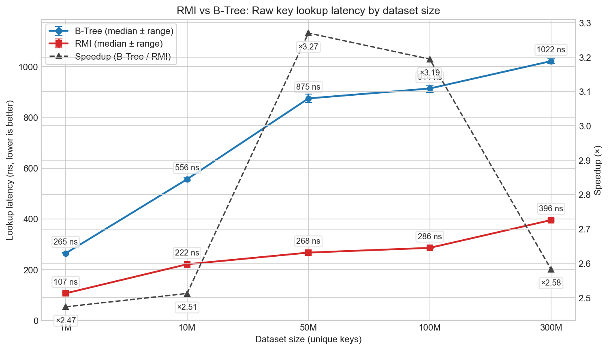
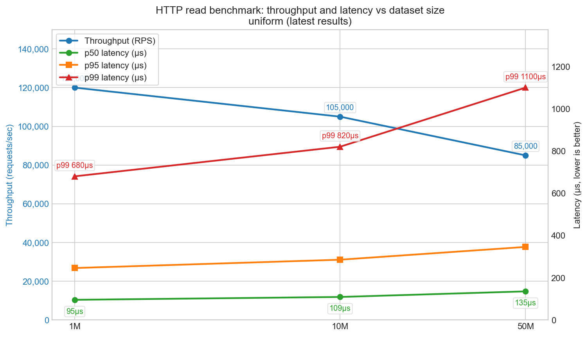

# KyroDB — Durable KV with a Production Recursive Model Index (RMI)

Status: Alpha (focused scope: KV + RMI)

KyroDB is a durable, append-only key-value engine with a production-grade learned index (RMI) for ultra-fast point lookups and predictable tail latency.

- Default read path: RMI (learned-index) with SIMD-accelerated probing
- WAL + snapshot durability, fast recovery, compaction controls
- Simple HTTP API under /v1, Prometheus metrics at /metrics, build info at /build_info


---

## Quickstart

Prereqs: Rust toolchain. Optional: Go for the CLI in `orchestrator/`.

- Build: `cargo build -p engine --release` (binary: `target/release/kyrodb-engine`)
- Run: `target/release/kyrodb-engine serve 127.0.0.1 3030`

Basic checks

- Health: `curl -s http://127.0.0.1:3030/health`
- Offset: `curl -s http://127.0.0.1:3030/v1/offset`
- Put: `curl -sX POST http://127.0.0.1:3030/v1/put -H 'content-type: application/json' -d '{"key":123,"value":"hello"}'`
- Get (fast): `curl -i http://127.0.0.1:3030/v1/get_fast/123`

Warm start (avoids cold-page tails)

- Auto: set env `KYRODB_WARM_ON_START=1` before starting
- Manual: `POST /v1/rmi/build` (if needed) then `POST /v1/warmup`

---

## Benchmarks

Engine microbenchmarks (in-process)

- Compare raw key-lookup latency for RMI vs B-Tree within the engine:
  - Run: `cargo bench -p bench --bench kv_index`
  - Try multiple scales by setting `KYRO_BENCH_N` (e.g., 1M, 10M, 50M, 300M):
    - `KYRO_BENCH_N=1000000 cargo bench -p bench --bench kv_index`
    - `KYRO_BENCH_N=10000000 cargo bench -p bench --bench kv_index`

HTTP workload benchmark (end-to-end)

- **Quick benchmark**: Start engine and run single test:
```
target/release/kyrodb-engine serve 127.0.0.1 3030
cargo run -p bench --release -- \
  --base http://127.0.0.1:3030 \
  --load-n 1000000 \
  --val-bytes 64 \
  --read-concurrency 64 \
  --read-seconds 30 \
  --dist uniform
```

- **Large-scale benchmarks** (10M/50M keys with skewed distributions):
```
# Run comprehensive benchmark suite
./bench/scripts/run_large_benchmarks.sh

# Or run specific configurations
./bench/scripts/run_large_benchmarks.sh check  # Check prerequisites
./bench/scripts/run_large_benchmarks.sh run    # Run all benchmarks
./bench/scripts/run_large_benchmarks.sh plots  # Generate plots only
```

- **Generate comprehensive plots**:
```
python3 bench/scripts/generate_plots.py
```

- **Manual benchmark** (legacy method):
```
COMMIT=$(git rev-parse --short HEAD)
cargo run -p bench --release -- \
  --base http://127.0.0.1:3030 \
  --load-n 10000000 \
  --val-bytes 64 \
  --load-concurrency 64 \
  --read-concurrency 64 \
  --read-seconds 30 \
  --dist uniform \
  --out-csv bench/results/${COMMIT}/http_uniform_10m.csv
```

Headline results (example data)

- RMI vs B-Tree (engine, lookup latency by dataset size). RMI is consistently faster with tighter tails due to an O(1) model prediction followed by a tiny bounded scan:



- HTTP read benchmark (uniform distribution, 64 concurrency, 30s, 64B values). Shows stable throughput and sub-2.2ms p99 across 1M–50M keys on our test box. Use `/v1/lookup_fast/{k}` for index-only numbers or `/v1/get_fast/{k}` to include value reads:



**Large-scale benchmark results** include:
- **10M and 50M key benchmarks** with uniform and Zipf distributions (θ=1.1, 1.5)
- **Comprehensive performance analysis** across scales and distributions
- **Automated artifact collection** with system information and detailed reports
- **Interactive plots** showing latency vs throughput trade-offs

Notes for fair numbers
- Warm the system (env `KYRODB_WARM_ON_START=1` or call `/v1/warmup`).
- Prefer release builds and keep the machine quiet.
- Consider `--features bench-no-metrics` to remove counter overheads.
- See `bench/README.bench.md` for full methodology.

---

## Testing

- CI test matrix (manual trigger): runs engine tests on Linux and macOS, across feature sets. See `.github/workflows/test-matrix.yml`.
- Fuzzing: cargo-fuzz targets for WAL and snapshot parsers are wired under `engine/fuzz/`. See `.github/workflows/fuzz.yml` and `docs/TESTING.md`.
- Concurrency: loom is considered for critical paths; not enabled in CI by default.

See `docs/TESTING.md` for details.

---

## API (selected)

Data plane (JSON unless noted)

- POST `/v1/put` → `{ "offset": <u64> }` on success
- GET `/v1/lookup_fast/{key}` → 200 octet-stream (8-byte offset) or 404
- GET `/v1/get_fast/{key}` → value bytes or 404
- GET `/v1/lookup?key=...` → JSON object on hit, `{ "error": "not found" }` on miss
- GET `/v1/lookup_raw?key=...` → 204 on hit, 404 on miss

Admin/ops

- POST `/v1/rmi/build` → `{ ok: bool, count: <usize> }`
- POST `/v1/warmup` → `{ status: "ok" }`
- POST `/v1/snapshot`, POST `/v1/compact`, GET `/v1/offset`, `POST /v1/replay`
- Metrics: GET `/metrics` (Prometheus)
- Build info: GET `/build_info` → `{ commit, features }`

Auth: start the server with `--auth-token <TOKEN>` and send `Authorization: Bearer <TOKEN>`.

---

## Operations

- Metrics: scrape `/metrics`
- Rate limiting (per-IP):
  - Admin routes default 2 rps, burst 5
  - Data routes default 5000 rps, burst 10000
  - Tune via env: `KYRODB_RL_ADMIN_RPS`, `KYRODB_RL_ADMIN_BURST`, `KYRODB_RL_DATA_RPS`, `KYRODB_RL_DATA_BURST`
- TLS via reverse proxy: if you need HTTPS, run behind a web server like Caddy or Nginx that terminates TLS and forwards to KyroDB on localhost. Example snippets are included for convenience; you can skip this if you don’t need HTTPS.

Caddy (simple automatic HTTPS)

```
# Caddyfile
kyro.example.com {
  reverse_proxy 127.0.0.1:8080
  header {
    Strict-Transport-Security "max-age=31536000; includeSubDomains; preload"
  }
}
```

Nginx (manual TLS via certbot)

```
server {
  listen 443 ssl http2;
  server_name kyro.example.com;
  ssl_certificate /etc/letsencrypt/live/kyro.example.com/fullchain.pem;
  ssl_certificate_key /etc/letsencrypt/live/kyro.example.com/privkey.pem;
  location / {
    proxy_pass http://127.0.0.1:8080;
    proxy_set_header Host $host;
    proxy_set_header X-Forwarded-For $proxy_add_x_forwarded_for;
    proxy_set_header X-Forwarded-Proto https;
  }
}
```

Additional operational notes live in `docs/`.

---

## Architecture (brief)

- WAL (append-only) + snapshot for durability and fast recovery
- In-memory recent-write delta; single-node read path
- RMI builder/loader with bounded probe; on-disk formats versioned
- Compaction triggers for WAL space management

**📊 Comprehensive architecture diagrams** including system overview, data flow, RMI structure, and performance characteristics are available in [`visiondocument.md`](visiondocument.md#8-architecture-diagrams).

---

## Vision

Curious about where this is going? See `visiondocument.md` for the broader roadmap: range queries, gRPC data plane, replication, and optional vector/ANN capabilities once the core KV + RMI path is rock solid.

---

## Current guarantees (Alpha)
- Single-key atomicity: each PUT is all-or-nothing; GET is atomic per key.
- Durability: WAL + snapshot with atomic index swap; recovery replays committed records only.
- Index correctness: RMI predictions are bounded and probed; data correctness does not depend on the model.

Not yet (roadmap)
- Multi-key transactions (BEGIN/COMMIT/ROLLBACK)
- Transactional isolation (MVCC/Snapshot Isolation)
- Replication/distribution

## Durability modes (ops)
- sync=always: fsync on commit for strongest durability (latency tradeoff)
- sync=group: group commits within N ms (throughput tradeoff)
- sync=none: benchmarking only

## Contributing and License

- Contributions welcome. Include tests for WAL/snapshot/RMI changes.
- License: Apache-2.0

Contact: open an issue; for quicker feedback ping @vatskishan03 or on Twitter(@kishanvats03)
