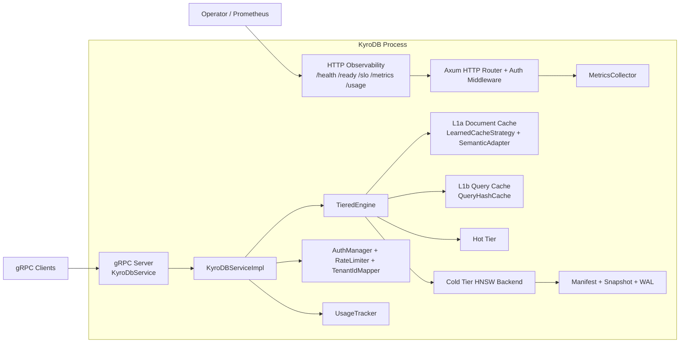
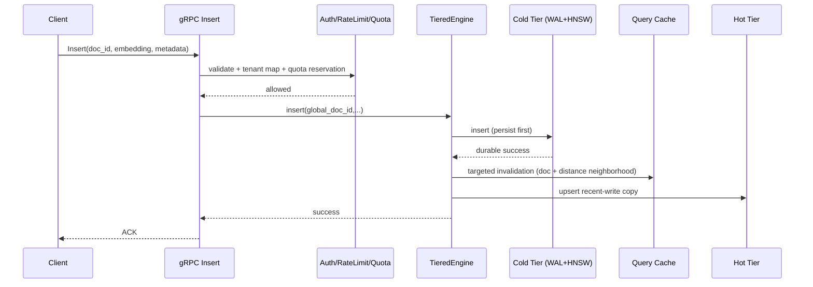
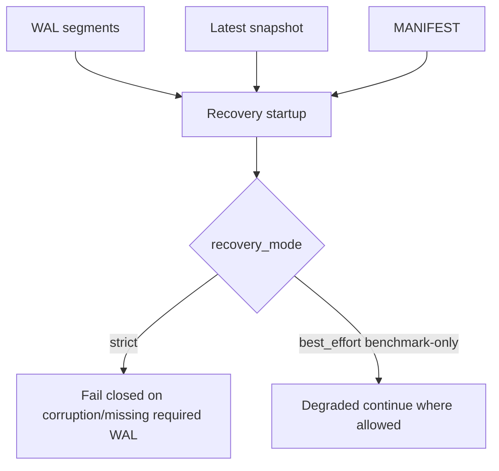

# Architecture

## Purpose

Provide the technical architecture reference for the KyroDB single-node runtime, including data flow, concurrency, durability boundaries, and security/isolation controls.

## Scope

- process-level topology and planes (gRPC data plane, HTTP observability plane, storage plane)
- tiered retrieval architecture (L1a/L1b/L2/L3)
- end-to-end write/read/search/recovery flows
- auth/tenancy boundaries and observability controls
- failure-containment and backpressure behavior

## Commands

```bash
# Start server with explicit config
./target/release/kyrodb_server --config config.toml

# Probe runtime planes
curl http://127.0.0.1:51051/health
curl http://127.0.0.1:51051/ready
curl http://127.0.0.1:51051/metrics

# Validate runtime architecture invariants (network e2e)
KYRODB_ENABLE_NET_TESTS=1 cargo test -p kyrodb-engine --test grpc_end_to_end
```

## Key Contracts

### System Boundary

- KyroDB is single-node and process-local; no distributed consensus/replication layer is in scope.
- Durability boundary is local filesystem (`persistence.data_dir`) via WAL, snapshots, and manifest.
- Outside benchmark mode, runtime is fail-closed on unsafe persistence/cache modes.

### Runtime Topology



### Component Roles

| Component | Role | Primary Files |
|---|---|---|
| gRPC service | RPC contract, validation, auth context, tenancy mapping, quotas | `engine/src/bin/kyrodb_server.rs` |
| Tiered engine | query/search orchestration across cache/hot/cold tiers | `engine/src/tiered_engine.rs` |
| L1a (HSC) | point-query/embedding cache with learned + semantic admission | `engine/src/cache_strategy.rs`, `engine/src/semantic_adapter.rs`, `engine/src/vector_cache.rs` |
| L1b | scoped semantic query-result cache | `engine/src/query_hash_cache.rs` |
| L2 | recent-write mirror, coherence-checked fast scan path | `engine/src/hot_tier.rs` |
| L3 | HNSW index + metadata index + WAL integration | `engine/src/hnsw_backend.rs`, `engine/src/ann_backend.rs`, `engine/src/persistence.rs` |
| Auth + tenancy | API key validation, tenant-local/global ID mapping, isolation | `engine/src/auth.rs`, `engine/src/bin/kyrodb_server.rs` |
| Observability | health/ready/slo/metrics/usage endpoint surface | `engine/src/bin/kyrodb_server.rs`, `engine/src/metrics.rs` |
| Backup/restore | fail-closed archival/verification/restore workflows | `engine/src/backup.rs`, `engine/src/bin/kyrodb_backup.rs` |

### Identifier and Metadata Model

- `doc_id` on RPC surface is tenant-local when auth is enabled.
- Server maps tenant-local IDs to global IDs (`(tenant_index << 32) | local_doc_id`).
- Server-owned metadata keys:
  - `__tenant_id__`
  - `__tenant_idx__`
  - `__namespace__`
- These keys are enforced/overwritten by server; client-provided values are not trusted.

### Insert Path (Durable-First)



Insert guarantees:

- ACK is returned only after durable cold-tier mutation succeeds.
- Quota reservation and insert mutation are serialized per-tenant/doc path to prevent double-count drift under concurrent upserts.
- L1b invalidation is targeted during insert; full clear is reserved for flush/reconciliation boundaries.

### Point Query Path (L1a Participation)

```mermaid
flowchart TD
    Q[Query(doc_id)] --> T1{Tenant/namespace visible?}
    T1 -->|no| NF[Not found]
    T1 -->|yes| C1{L1a hit?}
    C1 -->|yes| R1[Return cached embedding/metadata]
    C1 -->|no| H1{L2 hit?}
    H1 -->|yes| A1[HSC admission decision]
    A1 --> R2[Return]
    H1 -->|no| L31{L3 hit?}
    L31 -->|yes| A2[HSC admission decision]
    A2 --> R2
    L31 -->|no| NF
```

Point-query behavior:

- Point query path records training accesses for HSC lifecycle.
- Cross-tenant visibility is filtered before serving existence details.

### k-NN Search Path (Scoped L1b + Timed Tiered Execution)

```mermaid
flowchart TD
    S[Search(query,k)] --> V[Validate embedding/k/filter]
    V --> SC[Build scoped query-cache key]
    SC --> QC{L1b cache hit?}
    QC -->|yes| R0[Return cached top-k]
    QC -->|no| BP[Acquire query semaphore]
    BP --> HT[Hot-tier search with timeout]
    HT --> CT[Cold-tier HNSW search with timeout]
    CT --> M[Merge + dedupe + truncate k]
    M --> HYD[Hydrate response]
    HYD --> LOG[Log served doc_ids for training]
    LOG --> QCPUT[Insert scoped L1b entry]
    QCPUT --> OUT[Return response]
```

Search-specific contracts:

- L1b cache key is scope-aware (tenant + namespace + filter context), preventing cross-scope reuse.
- Timeout path uses bounded query semaphore + bounded worker semaphore.
- Worker saturation is explicitly tracked and can return partial results or reject when no viable partial exists.
- Response hydration:
  - metadata-only path when embeddings are not requested
  - cache-aware embedding fetch path (`get_embedding_cache_aware`) when embeddings are requested

### HSC (L1a) Lifecycle

```mermaid
flowchart LR
    PQ[Point queries] --> AL[AccessPatternLogger]
    SR[Search served doc_ids (top-N)] --> AL
    AL --> TT[Background Training Task]
    TT --> PRED[LearnedCachePredictor retrain]
    PRED --> STRAT[LearnedCacheStrategy update]
    STRAT --> MET[HSC lifecycle metrics]
```

Lifecycle guarantees:

- Runtime L1a for non-benchmark deployments is HSC (learned + semantic adapter).
- Predictor updates preserve feedback backlog across retraining cycles.
- Metrics surface includes trained state, threshold, tracked docs, hot doc count, training skips, access logger depth, and semantic fast/slow/hit/miss counters.

### Concurrency and Backpressure Model

- Server state holds `Arc<TieredEngine>`; no outer global async `RwLock` around the engine.
- Search path uses:
  - query-concurrency semaphore (admission/load shedding)
  - blocking-worker semaphore (spawn-blocking saturation bound)
- Circuit breakers isolate tier failures and prevent cascading retries.
- Panic containment layer wraps gRPC request handling (`panic` => gRPC `INTERNAL`, process remains alive).

### Durability and Recovery Architecture



Durability contracts:

- Snapshot + manifest operations are serialized to avoid stale-manifest overwrite races.
- Recovery strict mode is default; benchmark-only best-effort is rejected in pilot/production configs.
- Insert path refuses unsafe append states (e.g., missing manifest in persistence mode) to avoid unrecoverable divergence.

### Backup/Restore Boundary

- Backup creation is fail-closed when source files change during archive creation (fingerprint + bounded retry).
- Restore has preflight integrity verification before destructive clear.
- Destructive clear is guarded by explicit confirmation (`BACKUP_ALLOW_CLEAR=true` or equivalent option).

### Tenancy and Security Boundary

- API key comparison is constant-time; sensitive key material is redacted from surfaced validation errors.
- Cross-tenant isolation is enforced in query/search usage paths and verified by auth-enabled gRPC e2e tests.
- `/usage`:
  - default scope is caller tenant (`self`)
  - `scope=all` requires admin key
  - `auth.enabled=false` returns `404`
- `server.observability_auth` independently controls `/metrics`, `/health`, `/ready`, `/slo` auth posture.

### Out of Scope (Current Architecture)

- distributed clustering or replication
- multi-node consensus, leader election, or shard routing
- cross-node durability guarantees

## Related Docs

- [TWO_LEVEL_CACHE_ARCHITECTURE.md](TWO_LEVEL_CACHE_ARCHITECTURE.md)
- [CONCURRENCY.md](CONCURRENCY.md)
- [CONFIGURATION_MANAGEMENT.md](CONFIGURATION_MANAGEMENT.md)
- [AUTHENTICATION.md](AUTHENTICATION.md)
- [OBSERVABILITY.md](OBSERVABILITY.md)
- [BACKUP_AND_RECOVERY.md](BACKUP_AND_RECOVERY.md)
