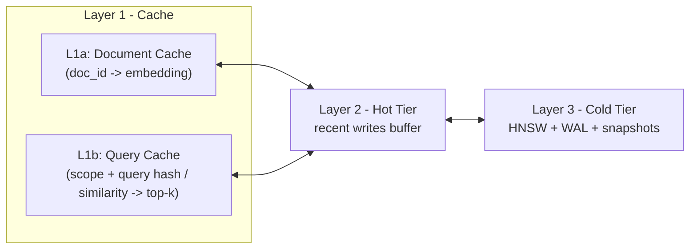
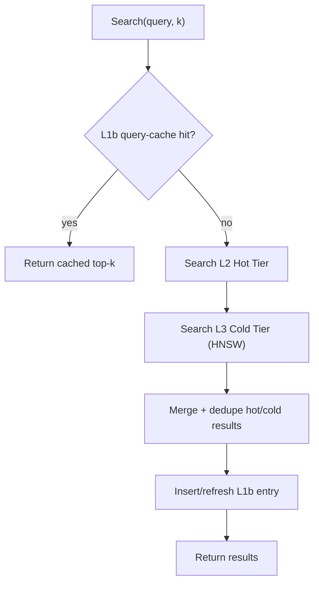
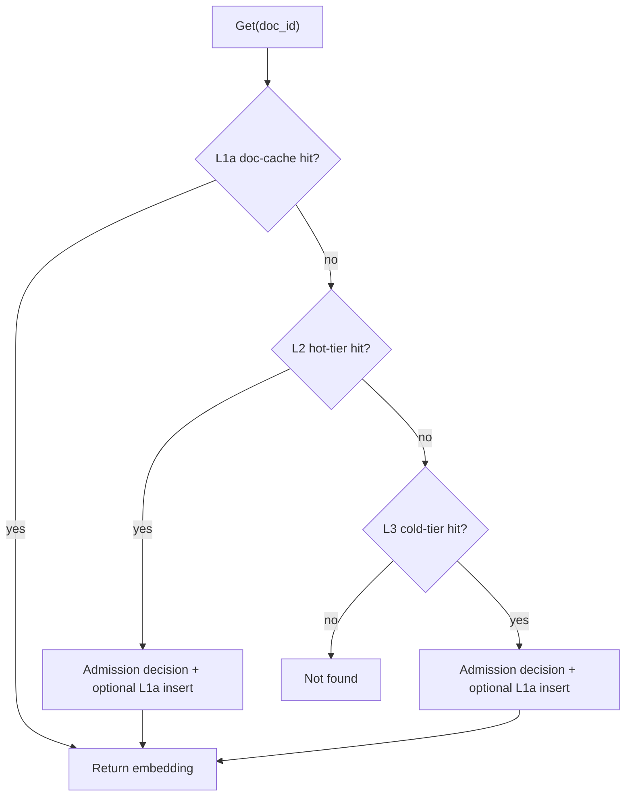
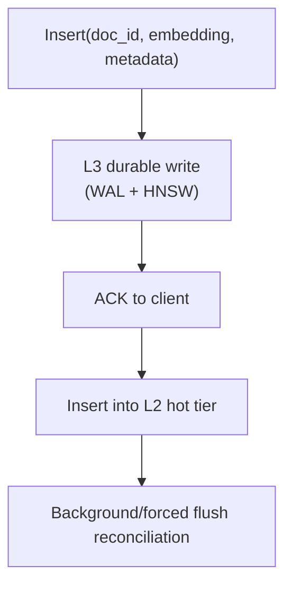

# Two-Level L1 Cache Architecture

## Purpose

Document the cache architecture that drives KyroDB read performance: L1a document cache + L1b semantic query cache, and how they interact with L2/L3.

## Scope

- architecture and request flows (search, point lookup, write)
- cache admission and invalidation behavior
- checked-in validation evidence from repository artifacts
- tuning and observability guidance for production operation

## Commands

```bash
# Build enterprise validation harness
cargo build --release -p kyrodb-engine --features cli-tools --bin validation_enterprise

# Show harness options
./target/release/validation_enterprise --help

# Run the 12-hour reference profile in this repo
./target/release/validation_enterprise --config validation_12hour_config.json

# Extract key benchmark fields from the generated artifact
python3 - <<'PY'
import json
obj = json.load(open("validation_12hour.json"))
print(f"Total queries: {obj['total_queries']:,}")
print(f"L1a hit rate: {obj['l1a_hit_rate']*100:.2f}%")
print(f"L1b hit rate: {obj['l1b_hit_rate']*100:.2f}%")
print(f"L1 combined:  {obj['l1_combined_hit_rate']*100:.2f}%")
print(f"Memory growth:{obj['memory_growth_mb']:.2f} MB ({obj['memory_growth_pct']:.2f}%)")
PY

# Inspect live cache metrics (server must be running)
curl -s http://127.0.0.1:51051/metrics \
  | grep -E 'kyrodb_cache_(hits|misses|hit_rate|size)|kyrodb_training_cycles_completed_total|kyrodb_hsc_(predictor_trained|cache_threshold|tracked_docs|hot_doc_count|training_skips_total|access_logger_depth|semantic_enabled|semantic_fast_path_decisions_total|semantic_slow_path_decisions_total|semantic_hits_total|semantic_misses_total|semantic_cached_embeddings)'
```

## Key Contracts

- L1a is HSC (learned predictor + semantic adapter) outside benchmark mode; non-HSC L1a strategies are benchmark-only.
- L1b is a semantic query-result cache (`QueryHashCache`) with scope isolation (`scope + query_hash` keying).
- k-NN path order is `L1b -> L2 -> L3`; point lookup path order is `L1a -> L2 -> L3`.
- Search response hydration uses metadata-only fetch when `include_embeddings=false`, and cache-aware embedding fetch when `include_embeddings=true`.
- `TieredEngine::insert` is durable-first: write through cold tier (WAL + HNSW) before ACK, then place recent copy in L2.
- insert path performs targeted L1b invalidation (`invalidate_doc` + distance-boundary invalidation), not global clear-per-write.
- Flush/migration events invalidate L1b entries to prevent stale query-result reuse.
- Cache benefits are workload-dependent; cold traffic and weak query reuse lower hit rate.

## Layer Topology



## Request Flows

### k-NN Search Path



Notes:

- L1b supports exact and similarity hits.
- Similarity matching is scope-isolated; entries from other scopes/tenants are never reused.
- For larger requested `k`, a smaller cached `k` forces miss/recompute to preserve correctness.

### Point Lookup Path



### Write Path



## Why Two L1 Layers (L1a + L1b)

| Workload pattern                            | L1a (doc cache) | L1b (query cache) | Combined effect          |
| ------------------------------------------- | --------------- | ----------------- | ------------------------ |
| Repeated access to same docs                | strong          | weak/moderate     | high                     |
| Paraphrased semantically-equivalent queries | weak            | strong            | high                     |
| First-time cold query                       | miss            | miss              | falls through to L2/L3   |
| Mixed RAG traffic                           | moderate        | moderate          | better than either alone |

L1a optimizes document reuse; L1b optimizes semantic query reuse. They cover different miss surfaces.

## Benchmark Evidence (Repository Artifact)

Reference run artifact:

- `validation_12hour.json`
- `validation_12hour_config.json`

Configuration snapshot:

- duration: 12h
- target QPS: 200
- corpus: 10,000 docs
- L1a capacity: 180
- training interval: 600s
- query reuse probability: 0.80

Measured results (`validation_12hour.json`):

| Metric                   | Value             |
| ------------------------ | ----------------- |
| Total queries            | 8,639,996         |
| L1a hit rate             | 63.48%            |
| L1b hit rate             | 10.06%            |
| L1 combined hit rate     | 73.54%            |
| L1b exact hits           | 37,168            |
| L1b similarity hits      | 831,773           |
| L3 cold-tier searches    | 2,286,352         |
| Expected training cycles | 72                |
| Actual training cycles   | 72                |
| Training task crashed    | false             |
| Memory growth            | 26.30 MB (11.70%) |

Interpretation:

- most L1b value comes from similarity hits, not exact repeats
- sustained training completed without crash in this run
- combined L1 hit rate materially reduces cold-tier search volume

## Metrics and Observability

Prometheus metrics expose aggregate cache behavior:

- `kyrodb_cache_hits_total`
- `kyrodb_cache_misses_total`
- `kyrodb_cache_hit_rate`
- `kyrodb_cache_size`
- `kyrodb_training_cycles_completed_total`
- `kyrodb_hsc_predictor_trained`
- `kyrodb_hsc_cache_threshold`
- `kyrodb_hsc_tracked_docs`
- `kyrodb_hsc_hot_doc_count`
- `kyrodb_hsc_training_skips_total`
- `kyrodb_hsc_access_logger_depth`
- `kyrodb_hsc_semantic_enabled`
- `kyrodb_hsc_semantic_fast_path_decisions_total`
- `kyrodb_hsc_semantic_slow_path_decisions_total`
- `kyrodb_hsc_semantic_hits_total`
- `kyrodb_hsc_semantic_misses_total`
- `kyrodb_hsc_semantic_cached_embeddings`

Important nuance:

- `/metrics` exports aggregate cache counters and HSC lifecycle metrics; detailed L1a/L1b split is still available via validation harness stats (`TieredEngineStats`) and validation artifacts, not as separate Prometheus counters.

## Tuning Guidance

- `cache.capacity`:
    - primary L1a capacity control; too small increases churn, too large increases memory.
- `cache.query_cache_capacity`:
    - increases L1b reuse window for paraphrases.
- `cache.query_cache_similarity_threshold`:
    - lower threshold increases hit rate but increases semantic-drift risk.
    - higher threshold is stricter and may collapse similarity hit rate.
- `cache.training_interval_secs`, `cache.training_window_secs`, `cache.recency_halflife_secs`:
    - govern adaptation speed vs stability of learned admission.
- `cache.logger_window_size`:
    - increases historical signal depth at higher memory cost.

## Failure and Correctness Notes

- L1b invalidation is selective on insert and full clear on hot-tier flush/reconciliation paths.
- Delete path invalidates L1a directly and removes L1b entries referencing deleted docs.
- Search timeout paths use bounded worker concurrency and cancellation to avoid unbounded backlog growth.
- Scope-aware query cache prevents cross-scope/tenant reuse.

## Related Docs

- [ARCHITECTURE.md](ARCHITECTURE.md)
- [CONFIGURATION_MANAGEMENT.md](CONFIGURATION_MANAGEMENT.md)
- [OBSERVABILITY.md](OBSERVABILITY.md)
- [CONCURRENCY.md](CONCURRENCY.md)
