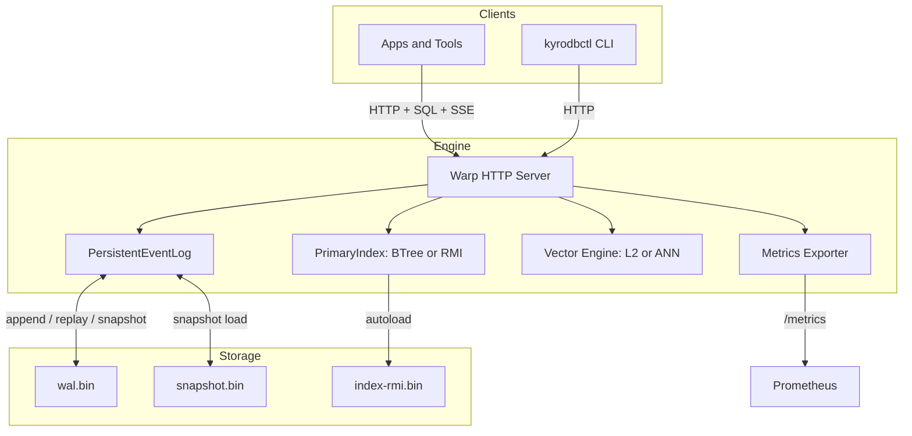
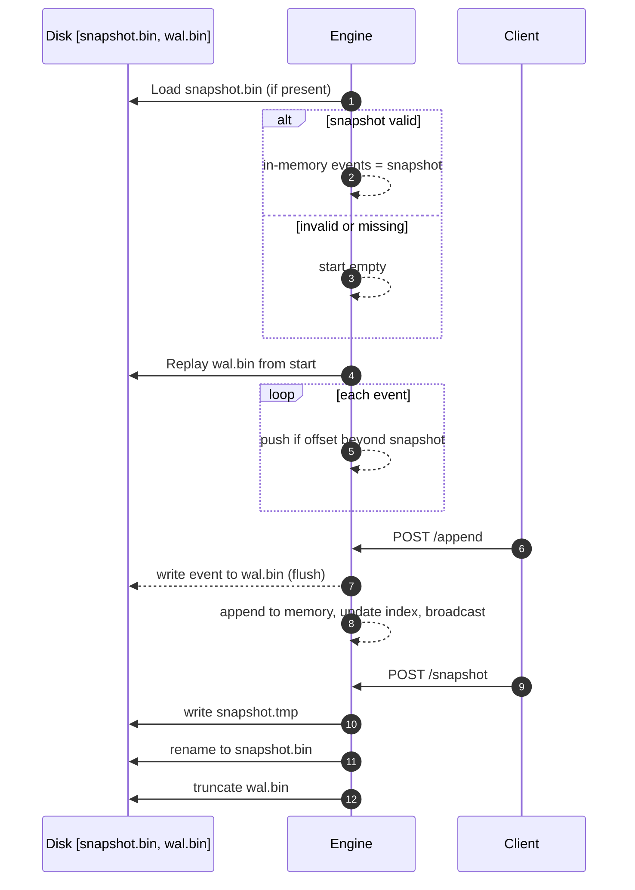

# ProjectKyro (KyroDB)

AI‑native database kernel: durable event log + KV + vector search with the path to learned indexes (RMI) and ANN (HNSW).

## Highlights
- Durable storage: WAL + snapshots; crash‑recoverable; WAL truncation after snapshot
- Real‑time: subscribe to live events (SSE)
- KV storage: `Record { key, value }` with idempotent appends and primary‑key lookup
- Minimal SQL: INSERT/SELECT for KV and vectors; vector queries with QUERY=[..] and optional MODE='ANN'
- Vector search: exact L2; optional ANN via HNSW (feature‑gated)
- Indexing: B‑Tree by default; RMI scaffolding (feature `learned-index`) with delta writes and autoload swap
- Observability: Prometheus metrics at `/metrics`
- Orchestrator: Go CLI (`kyrodbctl`) for health, snapshot, SQL, vector ops, RMI build

## Quickstart

Prereqs: Rust, Go.

```bash
# Run engine
RUST_LOG=kyrodb=info,warp=info cargo run -p engine -- serve 127.0.0.1 3030

# With ANN (optional)
RUST_LOG=kyrodb=info,warp=info cargo run -p engine --features ann-hnsw -- serve 127.0.0.1 3030

# With learned index feature available
RUST_LOG=kyrodb=info,warp=info cargo run -p engine --features learned-index -- serve 127.0.0.1 3030
```

### KV via SQL
```bash
curl -s -X POST http://127.0.0.1:3030/sql -H 'Content-Type: application/json' \
  -d '{"sql":"INSERT INTO t VALUES (42, '\''hello'\'')"}'

curl -s -X POST http://127.0.0.1:3030/sql -H 'Content-Type: application/json' \
  -d '{"sql":"SELECT * FROM t WHERE key = 42"}'
```

### Vector via SQL
```bash
# Insert a vector
curl -s -X POST http://127.0.0.1:3030/sql -H 'Content-Type: application/json' \
  -d '{"sql":"INSERT INTO vectors VALUES (1, [0.1,0.2,0.3])"}'

# Search (exact)
curl -s -X POST http://127.0.0.1:3030/sql -H 'Content-Type: application/json' \
  -d '{"sql":"SELECT * FROM vectors WHERE QUERY = [0.1,0.2,0.31] LIMIT 5"}'

# Search (ANN)
curl -s -X POST http://127.0.0.1:3030/sql -H 'Content-Type: application/json' \
  -d '{"sql":"SELECT * FROM vectors WHERE QUERY = [0.1,0.2,0.31] AND MODE='\''ANN'\'' LIMIT 5"}'
```

### Orchestrator (optional)
```bash
cd orchestrator && go build -o kyrodbctl
./kyrodbctl -e http://127.0.0.1:3030 health
./kyrodbctl sql "INSERT INTO t VALUES (42, 'hello')"
./kyrodbctl lookup 42
./kyrodbctl vector-insert 1 "0.1,0.2,0.3"
./kyrodbctl vector-search "0.1,0.2,0.31" 5
./kyrodbctl rmi-build
```

## HTTP API
- `POST /append` {payload}
- `GET /replay?start=..&end=..`
- `GET /subscribe?from=..` (SSE)
- `POST /put` {key, value}
- `GET /lookup?key=..`
- `POST /sql` { sql }
- `POST /vector/insert` { key, vector }
- `POST /vector/search` { query, k }
- `POST /rmi/build` (feature learned-index)
- `GET /offset`, `GET /health`, `POST /snapshot`, `GET /metrics`

## Features (current)
- WAL + snapshot recovery, WAL truncation post‑snapshot
- Minimal SQL for KV/vectors; ANN hint
- `PrimaryIndex` with BTree; RMI scaffolding (delta writes, autoload swap)
- Vector exact L2; optional HNSW ANN
- Prometheus metrics

## Roadmap (MVP)
- RMI v1: 2‑stage linear models with ε‑bounds; bounded probe; rebuild/swap; metrics
- ANN v1: expose M/ef parameters, background rebuild; benchmarks (recall/latency)
- DDL/schema: explicit `CREATE VECTORS name (dim INT)`, drops
- Autotuner: one knob (buffer/broadcast)
- Compaction/GC: latest‑value per key; bounded WAL growth
- Security/packaging: token/TLS, Docker, optional Helm
- Benchmarks + demo app

## Vision
See `visiondocument.md` for the AI‑native design and long‑term roadmap.

## Contributing
PRs and issues welcome.

## License
Apache-2.0

## Architecture



## Recovery Flow



## Design Docs
- RMI ADR: `docs/adr/0001-rmi-learned-index.md`

## Status vs MVP
- Current: BTree primary index; learned-index feature includes RMI scaffolding (delta writes, autoload swap) and an `/rmi/build` stub that writes an index file from key→offset pairs.
- MVP target: full RMI with 2‑stage models + ε‑bounds and bounded probe; measurable ≥2x point‑lookup speedup. ANN HNSW with tunables and background rebuilds.
