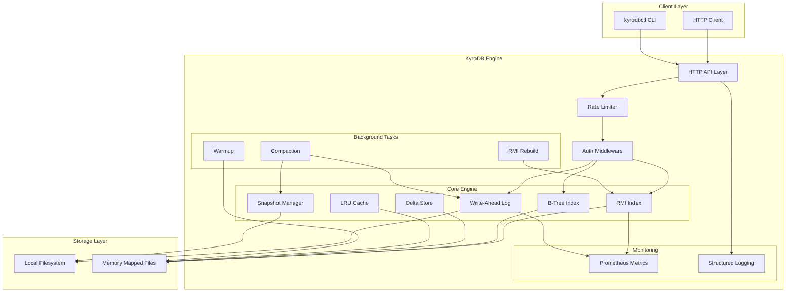
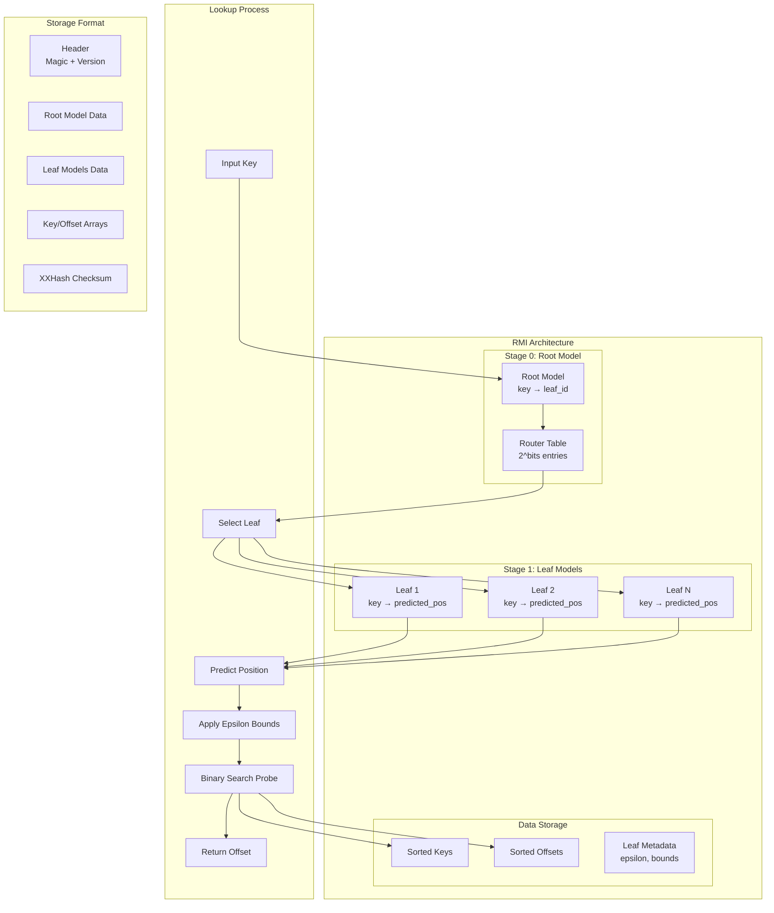
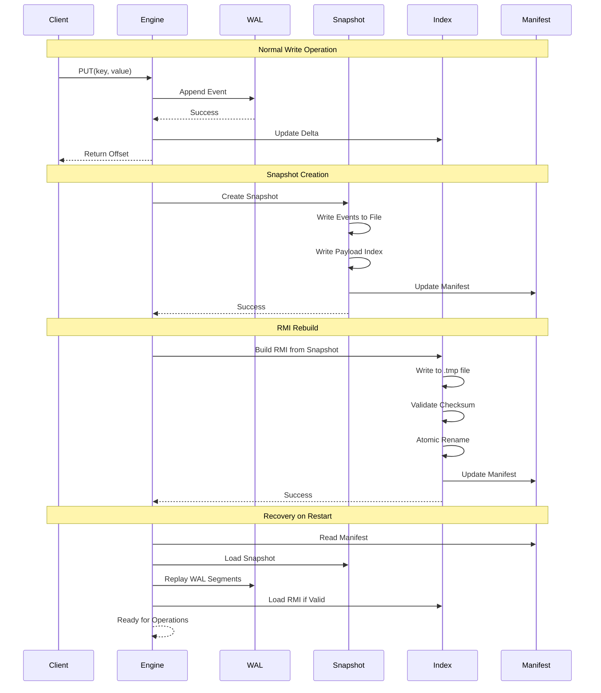
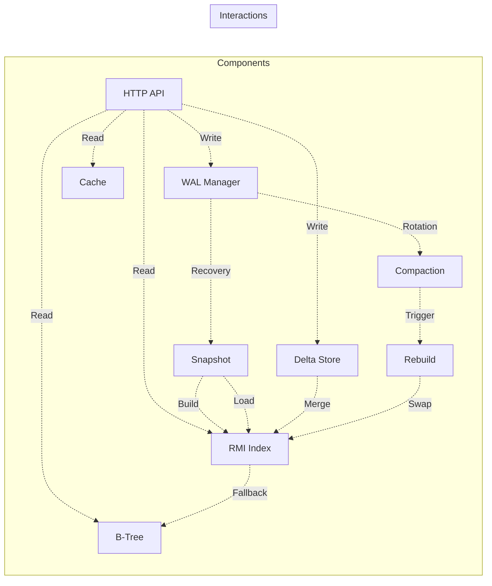
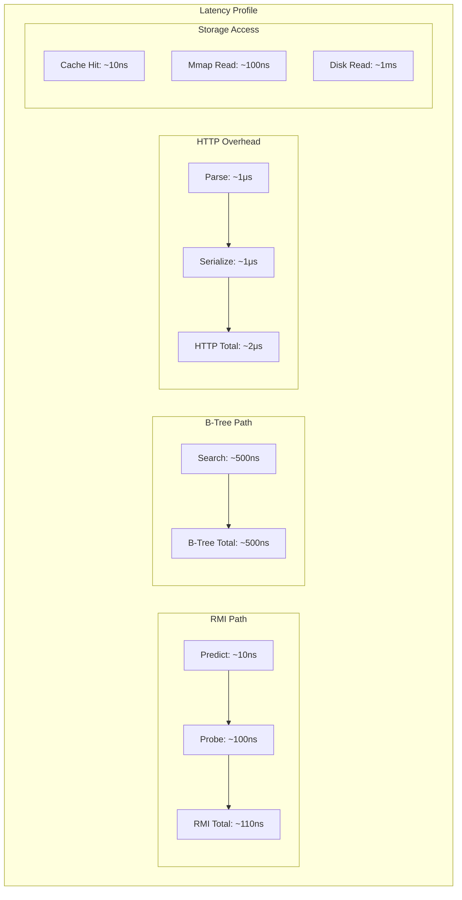

# KyroDB — Vision Document (Expanded)

**Status:** Living vision — broad long-term goals while remaining grounded in the short-term KV + RMI focus in the README.

> **Elevator pitch (long-term):** KyroDB aims to be an AI-native database that fuses learned systems and classical database correctness to become a self-optimizing, auditable, and developer-friendly data platform for AI-first applications — from single-node RMI-accelerated KV engines to federated, autonomous database fabrics that natively support model training, inference, provenance, and governance.

---

## Current Status 

- Scope: production-grade single-node KV + RMI focus.
- Transport: HTTP/JSON for both data and control today; gRPC data-plane planned in Phase A.
- Tooling: kyrodb-engine (server) + kyrodbctl (Go CLI) over HTTP.
- Vectors/ANN: deferred to later phases; not enabled by default.
- “Kernel” is an explicit target: near-term work includes defining storage/index traits and swapping index implementations.

---

# 1. Vision Summary

KyroDB’s long-term ambition is to blur the lines between data platforms and model infrastructure. The database should not just *store data* — it should *learn from it*, *optimize itself*, and *enable AI workflows* with built-in primitives for provenance, reproducibility, and governance. Over time KyroDB will graduate from a production-grade single-node KV + RMI engine (the immediate focus) into a modular ecosystem supporting vectors, in‑database model ops, self-tuning knobs, and federated learning, while preserving strong durability, auditability, and developer ergonomics.

This vision balances two things:

1. **Research excellence** — publishable, reproducible contributions (e.g., integrating learned indexes in a durable KV engine).
2. **Engineering pragmatism** — ship stable, benchmarked software that developers can run and trust.

---

# 2. Problem Space & Opportunity

Modern AI stacks are complex: ingestion pipelines, streaming infra (Kafka), OLTP/OLAP stores, vector DBs, separate model infra, provenance tooling, and orchestration. This complexity results in:

* operational overhead and expensive glue code;
* brittle pipelines that break under a production incident;
* lack of end-to-end provenance for model-driven decisions;
* duplicated storage and inconsistency between vector/materialized views.

KyroDB reduces the stack surface by natively combining **event-sourced durability**, **learned indexing**, and **AI-friendly access patterns** while adding the governance and reproducibility primitives AI applications need.

**Market signals:** increasing interest in learned indexes (research + early engineering), provider-built vector capabilities in major cloud DBs, and developer demand for simpler RAG pipelines.

---

# 3. North-Star Goals 

* **Research North-star:** Demonstrate that learned primary indexes can be productionized with durability guarantees and outperform classical indices on realistic workloads; publish reproducible results and release code artifacts.
* **Product North-star:** A lightweight, pluggable database kernel that: durable by default, self-tuning, provides first-class vector and model ops, and can power both developer prototypes and regulated production services.
* **Ecosystem North-star:** A healthy open-source community and reproducible benchmark suite that becomes the reference for learned-index research and engineering trade-offs.

Success signals: peer-reviewed paper or arXiv preprint, reproducible benchmarks used by third parties, stable 1.0 engine with adoption in small/medium production projects.

---

# 4. Pillars of KyroDB

## 4.1 Correctness & Durability

Durability is non-negotiable. All learned components must sit on top of clear, auditable storage semantics: WAL + atomic snapshots + clear recovery story. KyroDB’s design principle: **learning augments indexing/performance, never weakens correctness guarantees**.

## 4.2 Reproducible Research & Engineering

Every benchmark, experiment, and design choice must be reproducible: commit hashes, exact scripts, random seeds, and Dockerized runners. This provides credibility in the research community and confidence for adopters.

## 4.3 Self-Optimization (AI4DB)

KyroDB will use data-driven components to tune itself: learned indexes, cost models, autoregressive knob tuning, and query-plan selection. Human operators remain in control of policies and safety fences.

## 4.4 Developer Ergonomics

Provide a small, composable surface: a binary + light SDKs (Rust/Go/TS), clear admin tooling, and worked examples (RAG demo, OLTP + auditing example). The product must be easy to run locally and in CI.

## 4.5 Governance & Provenance

Built-in mechanisms for lineage, immutable logs of model inferences, data-versioning, and audit trails for regulatory compliance.

## 4.6 Modularity & Extensibility

The kernel should expose clear extension points — storage engines, index plugins (RMI, B-Tree), vector backends — so advanced features can be added without monolithic complexity.

---

# 5. Roadmap (expanded — north-to-south view)

This roadmap spans immediate priorities (KV + RMI) to advanced ambitions (distributed self-driving DB). Each phase includes deliverables and success criteria.

## Phase A — Foundation 

**Goal:** Production-grade KV + RMI.
**Deliverables:** durable WAL, atomic snapshot+manifest, mmap RMI binary and builder, compaction, HTTP data-plane initially; migrate data-plane to gRPC, bench harness, CI fuzz tests.
**Success:** reproducible benchmarks (10M/50M/1B), recovery invariants proven by tests, preprint draft outlining RMI productionization.

## Phase B — Polish & Research 

**Goal:** polish RMI, thorough evaluation, and research dissemination.
**Deliverables:** memory layout optimizations, mispredict heuristics, autoscheduler for re-index builds, publication-ready experiments, documentation & blog series.
**Success:** accepted preprint or public peer feedback; external reproductions of benchmarks.

## Phase C — Vertical Expansion 

**Goal:** add vector primitives, filters, and simple declarative query extensions.
**Deliverables:** vector storage + ANN integration (plugin), metadata filters for vector search, canonical RAG demo, SDK improvements.
**Success:** RAG demo used by external devs; bench comparisons vs Pinecone/Weaviate for select workloads.

## Phase D — Autonomy & Governance

**Goal:** add self-tuning, workload-aware policies, governance and provenance features.
**Deliverables:** adaptive knob tuning, model-registry integration, lineage trackers, explainability hooks, compliance features.
**Success:** KyroDB demonstrates lower operational costs on targeted workloads and provides audit trails for sample regulated use-cases.

## Phase E — Scale & Distribution 

**Goal:** optional distributed mode — sharding, replication, and multi-region.
**Deliverables:** consensus-backed metadata layer, partitioning strategies that preserve learned-index guarantees, WAL replication.
**Success:** production-grade distributed offering or a managed service prototype.

---

# 6. Research Agenda

KyroDB’s research contributions should be focused and reproducible. Candidate topics:

* **Productionizing learned indexes:** error bounds, rebuild policies, mmapped layout, update handling and recovery semantics.
* **Workload-adaptive indexing:** dynamic bucketization and hybrid RMI/B-Tree fallbacks.
* **Cost of learning vs cost of rebuild:** model complexity vs rebuild frequency trade-offs.
* **Combined vector+event provenance:** how to maintain reproducible RAG pipelines with immutable logs.

Each research paper must include: code, dataset generation scripts, run commands, and an artifact bundled in a Docker image.

---

# 7. Architecture Principles (non-exhaustive)

* **Immutable log as source-of-truth.** The WAL + snapshot becomes the canonical history for audits, rebuilds, and time-travel.
* **Index immutability per epoch.** RMI indices are built off snapshots and swapped atomically; live writes land in the WAL + mem-delta.
* **Mispredict detector.** Track probe lengths and mispredict rates; trigger rebuilds if error grows beyond thresholds.
* **Separation of control & data planes.** Today: HTTP/JSON for data and admin while iterating; Phase A: migrate data-plane to gRPC for low-latency ops, keep HTTP for admin/metrics.
* **Pluggable index/storage traits.** Provide documented interfaces for swapping implementations.

---

# 8. Architecture Diagrams

## 8.1 System Overview

## 8.2 Data Flow Architecture

```mermaid
flowchart TD
    subgraph "Write Path"
        PUT[PUT Request] --> VALIDATE[Validate Input]
        VALIDATE --> WAL[Append to WAL]
        WAL --> DELTA[Update Delta Store]
        DELTA --> RESPONSE[Return Offset]
    end
    
    subgraph "Read Path"
        GET[GET Request] --> LOOKUP[Index Lookup]
        LOOKUP --> RMI{Use RMI?}
        RMI -->|Yes| RMI_LOOKUP[RMI Predict + Probe]
        RMI -->|No| BTREE_LOOKUP[B-Tree Lookup]
        RMI_LOOKUP --> OFFSET[Get Offset]
        BTREE_LOOKUP --> OFFSET
        OFFSET --> FETCH[Fetch Value]
        FETCH --> CACHE{In Cache?}
        CACHE -->|Yes| CACHE_RET[Return Cached]
        CACHE -->|No| SNAP_LOOKUP[Snapshot Lookup]
        SNAP_LOOKUP --> CACHE_STORE[Store in Cache]
        CACHE_STORE --> CACHE_RET
        CACHE_RET --> RESPONSE_READ[Return Value]
    end
    
    subgraph "Background Operations"
        TRIGGER[Rebuild Trigger] --> REBUILD[RMI Rebuild]
        REBUILD --> SWAP[Atomic Index Swap]
        SWAP --> MANIFEST[Update Manifest]
        
        COMPACT_TRIGGER[Compaction Trigger] --> COMPACT[Compact WAL]
        COMPACT --> SNAPSHOT[Create Snapshot]
        SNAPSHOT --> CLEANUP[Clean Old Segments]
    end
```

## 8.3 RMI (Recursive Model Index) Structure

## 8.4 WAL + Snapshot Durability Model

## 8.5 Component Interaction Matrix

## 8.6 Performance Characteristics

---

# 9. Use Cases & Target Customers

* **AI startups building RAG systems** who want provenance and simplified infra.
* **SMBs with heavy point-lookup workloads** who need low p99 and compact indexes without operating Kafka.
* **Research groups** studying learned indexes and system-level trade-offs.
* **Regulated industries** requiring immutable logs plus semantic search or auditability (finance, healthcare).

---

# 10. Ethics, Safety & Governance

* Ensure **transparency**: logs include model versions used for inference and training artifacts.
* **Bias detection hooks**: enable tooling to detect distributional drift or biased outcomes.
* **Access controls**: plan for RBAC, TLS, and audit logs before adoption in regulated environments.
* **Responsible release**: ensure any ML components released with clear caveats about training data and expected behavior.

---

# 11. Community & Growth Strategy

* **Open artifacts**: publish paper drafts, bench results, and Dockerized experiments.
* **Encourage reproducible PRs**: label PRs that add benchmark evidence.
* **Engage researchers**: invite external reproductions, host dataset/bench challenges.
* **Documentation & tutorials**: shipping canonical demos (RAG, audit log replay, small-scale production example).

---

# 12. Success Metrics (signals to track)

* **Engineering:** green CI with fuzz tests; 0 reproducible correctness bugs in fuzz suite.
* **Performance:** p99 improvement vs baseline on at least two distributions; memory reduction for index.
* **Research:** completed reproducible paper + artifact.
* **Adoption:** opensource stars, forks running benchmarks, at least one external production adopter or pilot.

---

# 13. Governance & Licensing

KyroDB is Apache-2.0. Maintain a CLA/CONTRIBUTING doc for larger contributions. Keep governance minimal at first, formalize if community grows.

---

# 14. Next Actions (short-term)

1. Finalize README + charter (done).
2. Lock scope to KV + RMI and start Phase A deliverables.
3. Create reproducible bench harness and publish first CSVs.
4. Draft the first preprint outline using the `paper/` directory (data + scripts + Docker).

---

# Appendix

**Glossary**: RMI = Recursive Model Index; mmap= Memory Mapped; WAL = Write-Ahead Log; RAG = Retrieval-Augmented Generation.

**Contact**: [kishanvats2003@gmail.com](mailto:kishanvats2003@gmail.com) | GitHub: @vatskishan03 and Twitter(kishanvats03)
