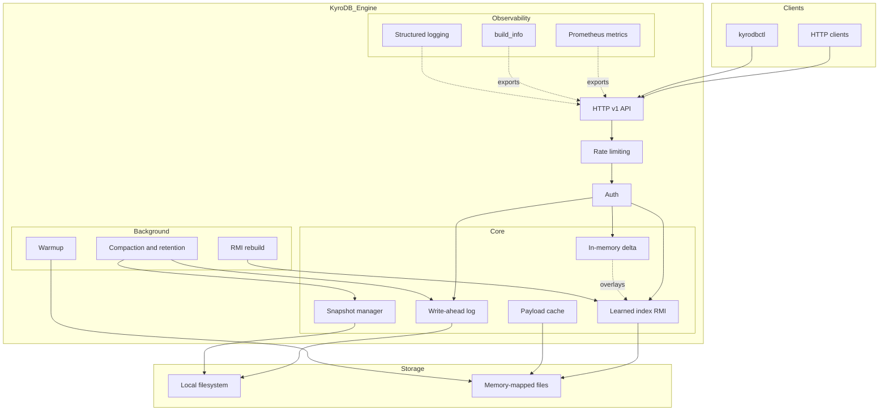
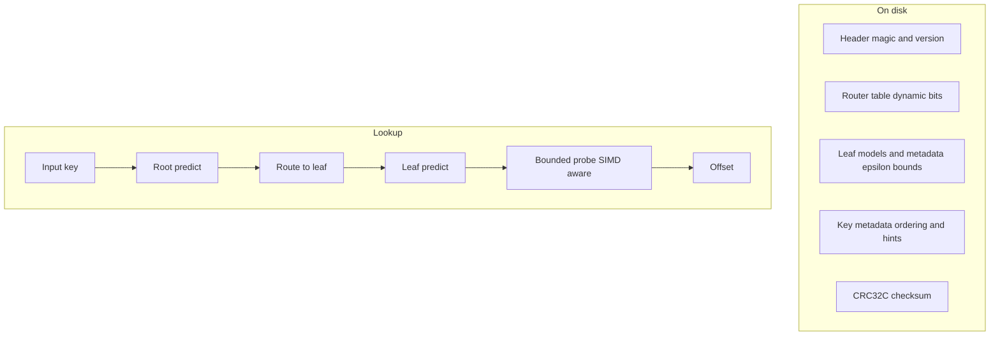

# KyroDB — Vision and Architecture (Story Edition)

Status: living document. Grounded in today’s single‑node KV + RMI engine; points the way to a broader data platform.

---

## The arc of KyroDB (why and where we’re going)

Modern AI applications bolt together many systems: streams, OLTP, vector stores, feature stores, provenance tools, and model infra. It works — until it doesn’t. Incidents cascade, glue code multiplies, and nobody can answer simple questions like “what decision did the model make and why?”

KyroDB starts from a simple, durable core and grows into an AI‑native database. We fuse learned systems with classical database correctness. The end goal is a platform that learns from data, optimizes itself, and offers built‑in primitives for provenance and governance — without sacrificing durability or developer ergonomics.

A story in three acts:
- Act I — Make the core undeniable: a production‑grade single‑node KV engine with a learned primary index (RMI), honest latency tails, and a clear durability story.
- Act II — Programmable intelligence: adaptive indexing, self‑tuning knobs, and optional vector primitives behind stable traits, with a clean API/SDK surface.
- Act III — Federated and autonomous: replication, sharding, and policy‑driven optimization that keeps correctness and auditability front and center.

---

## Where we are now (today)

KyroDB is a single‑node, durable key–value engine with a learned primary index.

- Interface: HTTP/JSON v1. Control and data share one surface for now.
- Durability: append‑only WAL, atomic snapshots (manifested), clean recovery.
- Reads: RMI is the default read path; values fetched via a mmap’d payload index.
- Writes: fast appends into WAL; a small in‑memory delta makes new keys visible immediately.
- Swap: RMI is rebuilt off a snapshot and swapped atomically; reads stay linearizable.
- Ops: Prometheus metrics (/metrics), build info (/build_info), health (/health), rate limiting and bearer auth. Warm‑on‑start and HTTP logging toggle.

Key endpoints (v1): /v1/put, /v1/get_fast/{key}, /v1/snapshot, /v1/rmi/build, /v1/warmup.

---

## Why KyroDB (the problem and our bet)

- Today’s AI stacks are a zoo of services. They’re powerful but operationally heavy. Data and semantics scatter across systems.
- Learned indexes show real promise, but many demos ignore durability, rebuild behavior, and hot read paths under load.
- Our bet: start with a correct, observable kernel that productionizes learned indexing; then open carefully chosen extension points for vectors and model‑aware features. No magic. Evidence over hype.

---

## System overview

What to notice:
- Single binary, local disk, mmap for hot value fetches.
- Learned index augments performance; correctness is anchored in WAL+snapshot.
- Background work never blocks reads; swaps are atomic.

---

## Read, write, and background flows

```mermaid
flowchart TD
  subgraph Write_Path
    P1[PUT key,value] --> P2[Validate]
    P2 --> P3[Append event to WAL]
    P3 --> P4[Update in-memory delta]
    P4 --> P5[Return offset]
  end

  subgraph Read_Path
    G1[GET key] --> G2[RMI predict and probe]
    G2 --> G3[Resolve offset]
    G3 --> G4[Fetch via mmap payload index]
    G4 --> G5{Cache hit?}
    G5 -- Yes --> G7[Return value]
    G5 -- No --> G6[Insert into payload cache]
    G6 --> G7[Return value]
    G2 -. miss in snapshot .-> G8[Read from delta]
    G8 --> G7
  end

  subgraph Background
    B0[Heuristics error probe len volume] --> B10[Rebuild RMI]
    B10 --> B11[Validate and checksum]
    B11 --> B12[Atomic swap and manifest]

    B20[Size or age triggers] --> B21[Compact WAL]
    B21 --> B22[Create snapshot bin plus data]
    B22 --> B23[Prune old segments]
  end
```

Notes:
- Reads prefer the snapshot‑backed path; the delta overlays recent writes.
- Snapshots produce two files: structured state (bin) and mmap‑friendly payload (data).

---

## RMI at a glance (on-disk and lookup)

Today’s index is array‑of‑structures (AoS v5) with runtime SIMD dispatch, prefetching, and bounded probing under recorded epsilon. Rebuilds are driven by mispredict/volume thresholds and swap atomically.

---

## Durability and recovery

```mermaid
sequenceDiagram
  participant Client
  participant Engine
  participant WAL
  participant Snapshot
  participant Index
  participant Manifest

  Note over Client,Manifest: Normal write
  Client->>Engine: PUT(key,value)
  Engine->>WAL: append
  WAL-->>Engine: fsync ok
  Engine-->>Client: offset

  Note over Client,Manifest: Snapshot
  Engine->>Snapshot: build snapshot.bin + snapshot.data
  Snapshot->>Manifest: write + fsync
  Snapshot-->>Engine: ready

  Note over Client,Manifest: RMI rebuild
  Engine->>Index: build from snapshot
  Index->>Index: validate + checksum
  Index->>Manifest: atomic rename + update
  Index-->>Engine: swap pointer

  Note over Client,Manifest: Recovery
  Engine->>Manifest: read
  Engine->>Snapshot: mmap payload
  Engine->>WAL: replay tail
  Engine->>Index: load if present
  Engine-->>Engine: serve traffic
```

---

## API surface (v1) and ops knobs

- Data/control endpoints:
  - POST /v1/put, GET /v1/get_fast/{key}
  - POST /v1/snapshot, POST /v1/rmi/build, POST /v1/warmup
  - GET /health, GET /build_info, GET /metrics
- Security/ops:
  - Bearer auth header (optional)
  - Per‑IP rate limiting (env‑controlled)
  - KYRODB_WARM_ON_START, KYRODB_DISABLE_HTTP_LOG; RUST_LOG for logging

---

## Performance and benchmarking philosophy

- Bench warm vs cold explicitly; snapshot → rmi/build → warmup before measuring.
- Measure both overall and "during rebuild" lookup latency; watch fallback scan counters.
- Prefer full‑throttle tests with per‑request logging off and generous rate limits.
- Check mmap fast path is active (snapshot.data present) to avoid O(n) scans.

---

## End‑state vision (the “final point”)

KyroDB becomes an AI‑native database kernel with:
- Unified, immutable history (WAL) plus snapshot epochs for time travel and audits.
- Learned indexing as a first‑class primitive that adapts to workload and data drift.
- Optional vector storage/ANN behind a trait; filters and hybrid lookups in one place.
- Built‑in provenance: lineage of data, models, and inferences; reproducible pipelines.
- Self‑tuning policies with human‑visible safety rails and clear explainability hooks.
- A path to distribution (replication, sharding) that preserves the same invariants.

Success looks like: reproducible research artifacts; stable 1.0 used in production; a community that trusts the numbers and the durability story.

---

## How we’ll get there (strategy and milestones)

Pillars:
- Correctness first: learning augments performance, never weakens guarantees.
- Evidence over claims: benchmarks, CI, fuzzing, failpoints; publish scripts and CSVs.
- Small, strong kernel: clear traits for storage/indexes; feature plugins on top.
- Operational clarity: simple defaults, strong observability, safe rebuild/compaction.

Milestones (phased, not calendar‑bound):
- Phase A — Foundation: KV + RMI; atomic snapshots; mmap payload index; HTTP v1; bench harness; CI with fuzz and failpoints.
- Phase B — Polish & research: SIMD/runtime dispatch, router tuning, rebuild heuristics; publish evaluation and scripts.
- Phase C — Primitives expansion: vector storage + ANN behind a trait; filters; SDKs; canonical RAG demo.
- Phase D — Autonomy & governance: self‑tuning policies; model registry integration; lineage/audit features.
- Phase E — Scale out: replication, sharding; consensus‑backed metadata; WAL replication.

Each phase ships measurable artifacts (code, docs, data, plots) and success criteria.

---

## Risks and mitigations

- Rebuild interference with latency tails → segment metrics; throttle; delta‑first reads; atomic swap.
- Learned index drift → mispredict/probe metrics; rebuild thresholds; checksummed artifacts.
- mmap portability and OS quirks → clear tuning docs; fallbacks; checks on load.
- Durability regressions → failpoints for snapshot/rename/fsync; recovery tests; fuzzing.

---

## Who is it for (use cases)

- AI startups building RAG systems that want provenance and fewer moving parts.
- Services with heavy point lookups needing compact indexes and tight p99.
- Researchers exploring learned indexes with reproducible, honest results.
- Regulated workloads needing immutable logs plus search/audit hooks.

---

## Success signals

- Engineering: green CI with fuzz/failpoints; recovery matrix stable.
- Performance: tail latency improvements on realistic workloads; transparent plots.
- Research: public preprint + artifact; external reproductions of benchmarks.
- Adoption: external users running benches and pilots; constructive community.

---

## Appendix

- Metrics: /metrics (Prometheus). Includes RMI lookup latency and probe length, fallback counters, rebuild progress, WAL rotation/retention stats.
- Operational endpoints: /health, /build_info, /v1/snapshot, /v1/rmi/build, /v1/warmup.
- Helpful env toggles: warm on start, rate limit knobs, per‑request logging toggle.
- Benchmarks: in‑process (cargo bench -p bench --bench kv_index) and end‑to‑end (bench/README.bench.md).

**Glossary**: RMI = Recursive Model Index; mmap= Memory Mapped; WAL = Write-Ahead Log; RAG = Retrieval-Augmented Generation.

**Contact**: [kishanvats2003@gmail.com](mailto:kishanvats2003@gmail.com) | GitHub: @vatskishan03 and Twitter(kishanvats03)