# KyroDB — Vision and Architecture 

Status: Strategic implementation document. Foundation-first approach to building the world's most advanced AI-native database.

---

## The AI Infrastructure Problem We're Solving

**The Current Reality**: AI teams waste 60-80% of their engineering cycles managing infrastructure complexity instead of building AI features. A typical RAG application requires PostgreSQL + pgvector for metadata, Pinecone for vectors, Redis for caching, with 50-100ms query latency across network hops. When performance issues arise, teams spend days debugging which of the 5+ services is the bottleneck.

**The Fundamental Gap**: Existing databases were designed for 1970s OLTP workloads—not AI applications that need sub-10ms hybrid queries combining vector similarity, metadata filtering, and real-time ingestion. Bolting AI features onto legacy architectures will never deliver the performance AI applications demand.

**KyroDB's Mission**: Build the first database that eliminates the AI middleware tax—where learned indexing delivers 10x performance improvements, where vector operations are first-class citizens, where single queries replace entire middleware stacks, and where the database continuously optimizes itself using AI.

## Strategic Implementation Phases

**Our Strategy**: Foundation → AI Value → Intelligence → Scale → Autonomy

### 🔴 PHASE 0: Foundation Rescue Mission (Months 1-6) **← CRITICAL**
**Status**: Emergency fixes to make KyroDB production-ready
- **Problem**: Current codebase has O(n) fallback paths that destroy performance
- **Solution**: Bounded RMI search, lock-free concurrency, memory management
- **Goal**: Sub-1ms P99 latency, zero deadlocks, 10x PostgreSQL performance

### 🟡 PHASE 1: Prove AI-Specific Value (Months 7-12) 
**Status**: Become the fastest RAG acceleration engine
- **Problem**: RAG apps need 3+ databases with 50-100ms latency
- **Solution**: Native hybrid queries (vector + metadata + time) in <5ms
- **Goal**: 50+ production customers, clear competitive differentiation

### 🟢 PHASE 2: AI Platform Features (Months 13-18)
**Status**: Capabilities existing databases cannot match
- **Problem**: AI apps need A/B testing, model governance, multi-modal queries
- **Solution**: Native experimentation, model tracking, multi-modal fusion
- **Goal**: 100+ customers, ecosystem lock-in through AI-specific features

### 🔵 PHASE 3: Intelligent Distribution (Months 19-24)
**Status**: Multi-node with ML-driven optimization
- **Problem**: Static sharding doesn't adapt to AI workload patterns
- **Solution**: Learned data placement, intelligent query routing
- **Goal**: Enterprise customers, 50% better latency vs static sharding

### 🤖 PHASE 4: Autonomous AI Elements (Months 25-30)
**Status**: Self-optimizing database that learns
- **Problem**: AI infrastructure requires constant manual tuning
- **Solution**: Autonomous optimization, predictive scaling, self-healing
- **Goal**: 90% reduction in operational overhead, industry leadership

---

## Where We Are Now (Reality Check)

**Current State**: KyroDB v0.1 is a single-node experimental database with critical performance bugs that prevent production use.

**Critical Issues Preventing Production Deployment**:
- ❌ **O(n) Performance Catastrophe**: RMI prediction failures trigger linear scans that destroy performance at scale
- ❌ **Concurrency Deadlocks**: Multiple RwLocks create deadlock potential under concurrent load
- ❌ **Memory Leaks**: No resource limits or garbage collection, leading to OOM crashes
- ❌ **Unreliable Vector Search**: Vector infrastructure exists but isn't properly integrated

**What Actually Works Today**:
- ✅ **Basic HTTP API**: REST endpoints with authentication and rate limiting
- ✅ **RMI Foundation**: Core learned index implementation (needs major fixes)
- ✅ **WAL + Snapshots**: Basic durability guarantees (needs optimization)
- ✅ **SIMD Optimizations**: Performance engineering foundation is solid
- ✅ **Comprehensive Testing**: Fuzzing, property tests, failpoint injection

**Performance Reality**: Current performance is inconsistent due to O(n) fallbacks. When RMI works correctly, it shows 2-5x improvement vs B-trees. When it fails, performance becomes unusable.

---

## Why KyroDB Will Win: AI-Specific Technical Advantages

### 1. Learned Indexing Optimized for AI Workloads
**The Problem**: Traditional B-trees perform poorly on AI access patterns—embeddings have high dimensionality locality, time-series data has predictable patterns, and user queries follow power-law distributions.

**Our Solution**: RMI (Recursive Model Index) that learns from actual AI workload patterns:
```rust
// Workload-aware RMI that adapts to different AI access patterns
pub struct AIOptimizedRMI {
    // Different models for different AI patterns
    embedding_model: SpatialLocalityModel,
    temporal_model: TimeSeriesModel,
    user_behavior_model: PowerLawModel,
    // Automatic pattern detection and switching
    workload_classifier: WorkloadPatternDetector,
}
```

### 2. Native Multi-Modal Query Fusion
**The Problem**: AI applications need to search across vectors, text, and metadata simultaneously. Current solutions require 3+ database calls with network latency.

**Our Solution**: Single queries that existing databases cannot execute:
```rust
// Query impossible with PostgreSQL + pgvector + Redis
POST /v2/search/hybrid {
    "vector_similarity": {"embedding": [...], "threshold": 0.8},
    "text_search": "machine learning optimization",
    "metadata_filters": {"author_expertise": "senior", "publish_date": "2024"},
    "temporal_range": {"last_7_days": true},
    "fusion_strategy": "learned_ranking"
}
// Response in <5ms vs 50-100ms with current stacks
```

### 3. Real-Time Streaming with Immediate Searchability
**The Problem**: AI models need real-time feedback loops. Current databases batch process updates with minutes/hours delay.

**Our Solution**: Streaming ingestion with immediate searchability:
```rust
// Real-time document ingestion
POST /v2/documents/stream {
    "text": "Breaking news about AI breakthrough...",
    "auto_embed": true  // Generate embeddings automatically
}

// Immediately searchable (not batch processed)
GET /v2/search/similar_to="AI breakthrough"
// Document appears in results within milliseconds
```

### 4. Autonomous Optimization for AI Patterns
**The Problem**: AI workloads have complex, changing patterns that require constant manual tuning.

**Our Solution**: Database that learns and optimizes itself:
```rust
// Self-optimizing based on AI workload patterns
pub struct AutonomousAIOptimizer {
    // Learn optimal cache sizes for embedding dimensions
    embedding_cache_optimizer: EmbeddingCacheOptimizer,
    // Predict when to rebuild indexes before performance degrades
    rebuild_predictor: RebuildPredictor,
    // Automatically tune for different AI model types
    model_specific_tuner: ModelSpecificTuner,
}
```

---

## System overview


**Key Architecture Principles:**
- **Single Binary**: Everything runs in one process for simplicity and performance
- **Memory-Mapped Reads**: Direct OS-level access to hot data without copying
- **Atomic Operations**: Snapshots and index swaps never leave the system in inconsistent state
- **Background Isolation**: Maintenance tasks never block user operations
- **Observable by Default**: Rich metrics and health checks for operational visibility

---

## Read, write, and background flows


Notes:
- Reads prefer the snapshot‑backed path; the delta overlays recent writes.
- Snapshots produce two files: structured state (bin) and mmap‑friendly payload (data).

---

## RMI Architecture and Lookup Flow


**RMI Design Principles:**
- **Learned Index**: Uses machine learning models to predict key positions
- **Bounded Search**: Epsilon bounds limit search space to O(1) expected time
- **SIMD Acceleration**: Runtime CPU feature detection for optimal performance
- **Memory Efficiency**: AoS layout with 16-byte stride for gather operations
- **Crash Safety**: Checksummed files with atomic replacement

---

## Durability and recovery


---

## API surface (v1) and ops knobs

- Data/control endpoints:
  - POST /v1/put, GET /v1/get_fast/{key}
  - POST /v1/snapshot, POST /v1/rmi/build, POST /v1/warmup
  - GET /health, GET /build_info, GET /metrics
- Security/ops:
  - Bearer auth header (optional)
  - Per‑IP rate limiting (env‑controlled)
  - KYRODB_WARM_ON_START, KYRODB_DISABLE_HTTP_LOG; RUST_LOG for logging

---

## Performance and benchmarking philosophy

- Bench warm vs cold explicitly; snapshot → rmi/build → warmup before measuring.
- Measure both overall and "during rebuild" lookup latency; watch fallback scan counters.
- Prefer full‑throttle tests with per‑request logging off and generous rate limits.
- Check mmap fast path is active (snapshot.data present) to avoid O(n) scans.

---

## Performance Characteristics

```mermaid
graph LR
  subgraph "Latency Distribution"
    P99[P99 Latency<br/>Tail Performance]
    P50[P50 Latency<br/>Median Performance]
    AVG[Average Latency<br/>Mean Performance]
  end

  subgraph "Optimization Layers"
    SIMD[SIMD Acceleration<br/>AVX2/AVX512/NEON]
    MMAP[Memory Mapping<br/>Zero-copy reads]
    PREFETCH[Prefetching<br/>OS page hints]
    CACHE[Caching<br/>LRU payload cache]
  end

  subgraph "Workload Adaptation"
    ADAPTIVE[Adaptive Rebuild<br/>Mispredict thresholds]
    WARMING[Page Warming<br/>On startup]
    TUNING[Runtime Tuning<br/>Environment knobs]
  end

  subgraph "Metrics & Monitoring"
    PROBE_LEN[Probe Length<br/>Histogram]
    MISPREDICT[Mispredict Rate<br/>Counter]
    CACHE_HIT[Cache Hit Rate<br/>Gauge]
    REBUILD_TIME[Rebuild Duration<br/>Histogram]
  end

  P99 --> SIMD
  P50 --> MMAP
  AVG --> PREFETCH
  SIMD --> CACHE
  MMAP --> CACHE
  PREFETCH --> CACHE

  CACHE --> ADAPTIVE
  ADAPTIVE --> WARMING
  WARMING --> TUNING

  TUNING --> PROBE_LEN
  TUNING --> MISPREDICT
  TUNING --> CACHE_HIT
  TUNING --> REBUILD_TIME

  %% Performance targets
  subgraph "Target Performance"
    TARGET_P50["P50 < 10μs<br/>Point lookups"]
    TARGET_P99["P99 < 100μs<br/>Tail latency"]
    TARGET_QPS["QPS > 100K<br/>Sustained throughput"]
  end

  PROBE_LEN --> TARGET_P50
  MISPREDICT --> TARGET_P99
  CACHE_HIT --> TARGET_QPS
```




**Performance Philosophy:**
- **Measure Everything**: Rich metrics for latency, throughput, and cache efficiency
- **Optimize Tails**: P99 latency matters more than averages for user experience
- **Adaptive Behavior**: System learns and adapts to workload patterns
- **Memory Efficiency**: Zero-copy reads and intelligent caching reduce GC pressure

---

## End-State Vision: The Autonomous AI Database

**KyroDB 2.0** (The Self-Operating AI Database): A distributed database that eliminates operational overhead through continuous learning and autonomous optimization.

### Autonomous Capabilities
```rust
// Database that manages itself
kyrodb deploy --fully-autonomous \
    --business-objectives "minimize_cost,maximize_performance" \
    --sla-requirements "latency_p99:5ms,availability:99.99%" \
    --cost-budget "$10k_monthly"

// System operates with minimal human intervention
GET /v2/autonomy/status {
    "autonomous_decisions_last_30_days": 1247,
    "human_interventions_required": 3,
    "cost_savings_percentage": 32,
    "performance_improvement": "45% latency reduction",
    "next_optimization": {
        "type": "predictive_scaling",
        "eta": "2024-01-16T14:00:00Z",
        "confidence": 0.91
    }
}
```

### Self-Optimizing Engine
- **Predictive Performance**: Anticipates performance degradation before it happens
- **Automatic Tuning**: Continuously adjusts parameters based on workload patterns
- **Self-Healing**: Detects and fixes problems without human intervention
- **Cost Optimization**: Balances performance vs cost automatically

### Developer Experience
```bash
# Single command replaces entire AI infrastructure stack
kyrodb create-ai-stack --workload rag_application \
    --expected-qps 100k --regions us-east,eu-west

# Native AI operations with autonomous optimization
curl -X POST /v2/collections/documents -d '{
    "text": "Document content",
    "auto_embed": true,        # Automatic embedding generation
    "auto_optimize": true      # Autonomous index optimization
}'

# Hybrid queries that existing databases cannot execute
curl "/v2/search?q=neural+networks&vector_sim=0.8&user_segment=enterprise&auto_rank=true"
```

### Performance Targets
- **Latency**: P99 < 5ms for any query type across global deployments
- **Throughput**: 10M+ QPS sustained per cluster with autonomous scaling
- **Availability**: 99.99% uptime with automatic failover and self-healing
- **Efficiency**: 90% reduction in operational overhead vs current database stacks
- **Cost**: 50% lower TCO through intelligent resource optimization

---

## How We'll Get There: Foundation-First Strategy

### Current Priority: Phase 0 Foundation Rescue (Months 1-6)
**Critical Mission**: Fix performance-killing bugs that prevent production use

**Week 1-8: RMI Performance Crisis**
- Eliminate O(n) linear scan fallbacks with bounded binary search
- Implement epsilon tracking per leaf model for guaranteed O(log ε) performance
- Add comprehensive performance validation with pathological key distributions

**Week 9-16: Concurrency Overhaul**
- Replace multiple RwLocks with lock-free atomic structures using ArcSwap
- Implement lock-free update queues with background rebuild coordination
- Add comprehensive concurrency testing and deadlock detection

**Week 17-24: Memory Management & Integration**
- Implement resource budgets and automatic garbage collection
- Fix vector search integration with proper HNSW + RMI coordination
- Add production monitoring and graceful degradation

### Success Criteria for Phase 0
- ✅ **Zero O(n) fallbacks** under normal operation (currently fails)
- ✅ **Sub-1ms P99 latency** on 10M+ keys (currently inconsistent)
- ✅ **No deadlocks** under concurrent load testing (currently fails)
- ✅ **Bounded memory usage** with predictable performance (currently leaks)
- ✅ **10x PostgreSQL performance** on RMI-favorable workloads (currently unverified)

### Future Phases (After Foundation is Solid)
**Phase 1**: Prove AI-specific value with RAG acceleration
**Phase 2**: AI platform features (A/B testing, model governance)
**Phase 3**: Intelligent distribution with learned sharding
**Phase 4**: Autonomous optimization and self-healing capabilities

### Development Philosophy
**Depth Over Breadth**: Perfect single-node performance before adding distributed features
**Foundation First**: No new features until core performance issues are resolved
**Production Quality**: Every component must be enterprise-grade before moving forward
**Measure Everything**: Comprehensive benchmarking validates every optimization claim

## Competitive Positioning: What Existing Solutions Cannot Do

### vs PostgreSQL + pgvector
**Their Limitation**: Retrofitted vector support on 1970s row-oriented architecture
**Our Advantage**: 
- Native learned indexing optimized for AI access patterns
- Single-query hybrid operations (vector + metadata + text + time)
- 10x faster similarity search with bounded epsilon guarantees
- Autonomous optimization that adapts to workload changes

### vs Pinecone/Weaviate
**Their Limitation**: Vector-only databases that require separate metadata storage
**Our Advantage**:
- ACID compliance across all data types (vectors, metadata, text)
- Multi-modal queries impossible with vector-only databases
- Learned data placement and query routing
- Cost-effective due to unified architecture (no data movement costs)

### vs Traditional Databases (Oracle, SQL Server)
**Their Limitation**: Legacy architecture with AI features bolted on
**Our Advantage**:
- Built for AI from the ground up, not retrofitted
- Autonomous operation reduces DBA overhead by 90%
- Cloud-native architecture with intelligent scaling
- 50% lower TCO due to reduced middleware complexity

### The Sustainable Competitive Moat
**Why Our Advantages Are Hard to Replicate**:
1. **Learned Indexing Expertise**: 5+ years of RMI research and optimization
2. **AI-Native Architecture**: Fundamental design choices that can't be retrofitted
3. **Autonomous Capabilities**: ML-driven optimization that improves over time
4. **Multi-Modal Fusion**: Query execution strategies that require ground-up redesign

---

## Multi-Node Cluster Architecture


### Clustering Strategy
1. **Start Simple**: Replicated single-leader for high availability
2. **Smart Sharding**: Learned partitioning based on key access patterns
3. **Cross-Shard RMI**: Global learned indexes that route queries optimally
4. **Edge Distribution**: Read replicas at CDN edge locations
5. **Auto-Everything**: Self-healing, self-scaling, self-optimizing


---

## Risks and mitigations

### Technical Risks
- **Distributed Consensus Complexity** → Start with proven Raft, focus on learned optimizations
- **Cross-Shard Query Performance** → Global RMI indexes, intelligent query planning
- **Network Partitions** → Byzantine fault tolerance, multi-region redundancy
- **Data Rebalancing Overhead** → ML-driven placement, background migration
- **ML Model Drift in Storage** → Comprehensive metrics, automatic retraining triggers

### Market Risks
- **Incumbent Database Vendors** → Focus on AI-native features they can't easily add
- **Cloud Provider Competition** → Partner strategy, multi-cloud deployment
- **Customer Lock-in Concerns** → Strong migration tools, open-source core
- **Economic Downturn Impact** → Cost-saving value proposition, flexible pricing

---

## Who is it for (use cases)

### Primary Use Cases
1. **RAG Applications**: Document similarity + metadata filtering in single query
2. **Recommendation Systems**: Real-time personalization with vector similarity
3. **AI-Powered Search**: Semantic search combined with traditional filters
4. **Real-time AI**: Sub-10ms inference pipelines with dynamic feature stores
5. **Multi-modal AI**: Applications processing text, images, and structured data

### Specific Customer Profiles
- **AI Startups**: Need fast development cycles, can't afford complex infrastructure
- **E-commerce Giants**: Personalization at scale, real-time recommendations
- **Financial Services**: Fraud detection, risk analysis with strict latency requirements
- **Healthcare**: Medical AI applications with compliance and audit requirements
- **Cloud Providers**: Building AI platform offerings for their customers

---

## Data Flow and Consistency Model (Multi-Node)


### Distributed Learned Indexes
- **Global RMI**: Cross-shard routing table that learns access patterns
- **Shard-Local RMI**: Traditional single-node RMI within each shard
- **Edge RMI**: Lightweight indexes at CDN edge locations
- **Adaptive Rebalancing**: ML models predict hotspots and trigger migrations


---

## Appendix

- Metrics: /metrics (Prometheus). Includes cross-shard RMI routing latency, rebalancing progress, consensus latency, and regional replication lag.
- Operational endpoints: /health, /build_info, /v1/snapshot, /v1/rmi/build, /v1/warmup, /v1/cluster/status.
- Clustering commands: kyrodb cluster join/leave, automatic shard rebalancing, global RMI rebuilds.
- Helpful env toggles: warm on start, rate limit knobs, per‑request logging toggle, cluster discovery settings.
- Benchmarks: single-node (cargo bench) and distributed end‑to‑end scaling tests across 10-1000 nodes.

---

*KyroDB: The AI-Native Database — Where machine learning meets distributed data infrastructure* 🚀