# KyroDB — Vision and Architecture 

Status: living document. Grounded in today's single‑node KV + RMI engine; points the way to an AI-native data platform that eliminates middleware complexity.

---

## The arc of KyroDB (why and where we're going)

**The AI Infrastructure Crisis**: Modern AI applications are drowning in middleware complexity. A typical production AI stack requires 15-20 disparate services: PostgreSQL + pgvector for data, Pinecone/Weaviate for vectors, Redis for caching, Kafka for streaming, Elasticsearch for search, multiple monitoring tools, and countless glue services. Each adds latency, operational overhead, and failure points. When something breaks at 3 AM, engineers spend hours debugging which of the 20 services failed.

**Our Fundamental Bet**: AI workloads have fundamentally different characteristics than traditional OLTP—massive parallel reads, vector similarity, multi-modal data, real-time inference feedback loops, and extreme tail latency sensitivity. Bolting AI features onto 1970s database architectures will never deliver the performance, simplicity, or cost-effectiveness AI applications demand.

**KyroDB's Mission**: Build the world's first database engineered from the ground up for AI workloads—where machine learning optimizes the storage engine itself, where vector operations are first-class citizens, where billion-scale read throughput is the baseline, and where petabyte datasets don't compromise millisecond response times.

A story in three acts:
- **Act I — The Unshakeable Foundation**: Production-grade single-node engine with learned primary index (RMI), proving superior performance vs traditional B-trees with bulletproof durability
- **Act II — AI-Native Primitives**: Vector storage, multi-modal indexing, streaming ingestion, and adaptive query optimization—all native, no plugins
- **Act III — Planet-Scale Intelligence**: Multi-node distributed architecture serving millions of QPS across petabytes, with autonomous optimization and built-in AI governance

---

## Where we are now (today)

KyroDB v0.1 is a single‑node, durable key–value engine with a production learned primary index—proving that ML-optimized storage can outperform traditional approaches while maintaining ACID guarantees.

**Current Capabilities**:
- **Interface**: HTTP/JSON v1 API with comprehensive observability
- **Storage**: Append‑only WAL + atomic snapshots with sub-second recovery
- **Reads**: RMI default path with SIMD-accelerated probing, 2-5x faster than B-trees
- **Writes**: High-throughput WAL appends with configurable durability levels
- **Operations**: Prometheus metrics, health checks, rate limiting, authentication
- **Reliability**: Comprehensive fuzzing, failpoint injection, property-based testing

**Performance Today**: 150K+ ops/sec sustained, sub-millisecond p99 latency, linear scaling to 50M+ keys

Key endpoints (v1): [`/v1/put`](engine/src/main.rs), [`/v1/get_fast/{key}`](engine/src/main.rs), [`/v1/snapshot`](engine/src/main.rs), [`/v1/rmi/build`](engine/src/main.rs), [`/v1/warmup`](engine/src/main.rs).

---

## Why KyroDB (the AI-first database thesis)

### The Middleware Tax
Current AI stacks suffer from:
- **Latency Multiplication**: Every hop through middleware adds 5-50ms
- **Operational Complexity**: 20+ services means 20+ failure modes
- **Cost Explosion**: Separate licensing, hosting, monitoring for each component
- **Data Silos**: Vector embeddings in Pinecone, metadata in Postgres, cache in Redis
- **Consistency Nightmares**: No ACID across the full AI data pipeline

### AI Workload Characteristics (Why Traditional DBs Fail)
1. **Read-Heavy by 1000:1**: Inference >> training writes
2. **Vector-Native**: Embeddings aren't "blobs"—they're first-class searchable data
3. **Multi-Modal**: Text, images, audio, time-series in single queries
4. **Latency-Critical**: P99 < 10ms for real-time AI applications
5. **Scale-Elastic**: Burst from 1K to 1M QPS during viral content
6. **Temporal Sensitivity**: Model version, embedding drift, A/B test segmentation

### Our Architectural Principles
1. **ML in the Engine**: Learned indexes, adaptive caching, predictive prefetching
2. **Zero-Copy Everything**: SIMD operations, memory-mapped I/O, vectorized compute
3. **Native Multi-Modality**: Vectors, text, time-series, graphs—unified query interface
4. **Autonomous Optimization**: Self-tuning based on workload patterns
5. **Observable by Design**: Every operation instrumented for AI deployment debugging

---

## System overview


**Key Architecture Principles:**
- **Single Binary**: Everything runs in one process for simplicity and performance
- **Memory-Mapped Reads**: Direct OS-level access to hot data without copying
- **Atomic Operations**: Snapshots and index swaps never leave the system in inconsistent state
- **Background Isolation**: Maintenance tasks never block user operations
- **Observable by Default**: Rich metrics and health checks for operational visibility

---

## Read, write, and background flows


Notes:
- Reads prefer the snapshot‑backed path; the delta overlays recent writes.
- Snapshots produce two files: structured state (bin) and mmap‑friendly payload (data).

---

## RMI Architecture and Lookup Flow

```mermaid
graph TB
  subgraph "RMI Index Structure (On-Disk)"
    subgraph "Header (24 bytes)"
      MAGIC[RMI Magic<br/>8 bytes]
      VER[Version<br/>1 byte]
      FLAGS[Flags<br/>3 bytes]
      LEAF_COUNT[Leaf Count<br/>4 bytes]
      KEY_COUNT[Key Count<br/>8 bytes]
    end

    subgraph "Router Table (Dynamic Size)"
      ROUTER_BITS[Router Bits<br/>Configurable 8-24]
      ROUTER_ENTRIES["Router Entries<br/>2^bits × 4 bytes"]
    end

    subgraph "Leaf Models"
      LEAF_META[Leaf Metadata<br/>key_min, key_max,<br/>slope, intercept,<br/>epsilon, start, len]
      MODEL_PARAMS[Model Parameters<br/>Fixed-point arithmetic]
    end

    subgraph "Key Data (AoS v5 Format)"
      KEY_ARRAY[Sorted Keys<br/>u64 array]
      OFFSET_ARRAY[Offsets<br/>u32/u64 array<br/>16-byte stride]
    end

    subgraph "Integrity"
      CHECKSUM[xxHash3<br/>8 bytes]
    end
  end

  MAGIC --> VER
  VER --> FLAGS
  FLAGS --> LEAF_COUNT
  LEAF_COUNT --> KEY_COUNT
  KEY_COUNT --> ROUTER_BITS
  ROUTER_BITS --> ROUTER_ENTRIES
  ROUTER_ENTRIES --> LEAF_META
  LEAF_META --> MODEL_PARAMS
  MODEL_PARAMS --> KEY_ARRAY
  KEY_ARRAY --> OFFSET_ARRAY
  OFFSET_ARRAY --> CHECKSUM

  subgraph "Lookup Algorithm Flow"
    INPUT[Input Key<br/>u64] --> ROUTE["Router Lookup<br/>key shifted right by (64 - bits)"]
    ROUTE --> LEAF_SELECT[Select Leaf<br/>From router table]
    LEAF_SELECT --> PREDICT[Predict Position<br/>slope × key + intercept]
    PREDICT --> CLAMP["Clamp to Bounds<br/>max(0, min(pred ± ε, leaf_end))"]
    CLAMP --> PREFETCH[Prefetch Window<br/>OS page hints]
    PREFETCH --> PROBE{SIMD Probe<br/>AVX2/AVX512/NEON}
    
    PROBE --> HIT[Found Key<br/>Return offset]
    PROBE --> MISS[Not in window]
    MISS --> BINARY_SEARCH[Binary Search<br/>Bounded fallback]
    BINARY_SEARCH --> FOUND[Found in search<br/>Return offset]
    BINARY_SEARCH --> NOT_FOUND[Key not present<br/>Mispredict +1]
    
    HIT --> METRICS[Record probe len = 1]
    FOUND --> METRICS
    NOT_FOUND --> METRICS
  end

  subgraph "SIMD Probe Details"
    AVX512["AVX512 Path<br/>8-way gather + compare"]
    AVX2["AVX2 Path<br/>4-way gather + compare"]
    NEON["NEON Path<br/>2-way pairwise compare"]
    SCALAR["Scalar Fallback<br/>4-way unrolled loop"]
  end

  PROBE -.-> AVX512
  PROBE -.-> AVX2
  PROBE -.-> NEON
  PROBE -.-> SCALAR

  subgraph "Performance Optimizations"
    FIXED_POINT[Fixed-Point Math<br/>32-bit precision]
    PREFETCH_AHEAD[Prefetch Ahead<br/>64-byte strides]
    CACHE_ALIGNED[Cache Alignment<br/>Avoid false sharing]
    BRANCHLESS[Branchless Code<br/>Predictable execution]
  end

  PREDICT -.-> FIXED_POINT
  PREFETCH -.-> PREFETCH_AHEAD
  PROBE -.-> CACHE_ALIGNED
  BINARY_SEARCH -.-> BRANCHLESS

  %% Styling
  classDef headerClass fill:#e3f2fd,stroke:#0d47a1,stroke-width:2px
  classDef routerClass fill:#f3e5f5,stroke:#4a148c,stroke-width:2px
  classDef leafClass fill:#e8f5e8,stroke:#1b5e20,stroke-width:2px
  classDef dataClass fill:#fff3e0,stroke:#e65100,stroke-width:2px
  classDef lookupClass fill:#fce4ec,stroke:#880e4f,stroke-width:2px
  classDef simdClass fill:#e1f5fe,stroke:#01579b,stroke-width:2px
  classDef perfClass fill:#f3e5f5,stroke:#311b92,stroke-width:2px

  class MAGIC,VER,FLAGS,LEAF_COUNT,KEY_COUNT headerClass
  class ROUTER_BITS,ROUTER_ENTRIES routerClass
  class LEAF_META,MODEL_PARAMS leafClass
  class KEY_ARRAY,OFFSET_ARRAY,CHECKSUM dataClass
  class INPUT,ROUTE,LEAF_SELECT,PREDICT,CLAMP lookupClass
  class PREFETCH,PROBE,HIT,MISS,BINARY_SEARCH,FOUND,NOT_FOUND,METRICS lookupClass
  class AVX512,AVX2,NEON,SCALAR simdClass
  class FIXED_POINT,PREFETCH_AHEAD,CACHE_ALIGNED,BRANCHLESS perfClass
```



**RMI Design Principles:**
- **Learned Index**: Uses machine learning models to predict key positions
- **Bounded Search**: Epsilon bounds limit search space to O(1) expected time
- **SIMD Acceleration**: Runtime CPU feature detection for optimal performance
- **Memory Efficiency**: AoS layout with 16-byte stride for gather operations
- **Crash Safety**: Checksummed files with atomic replacement

---

## Durability and recovery


---

## API surface (v1) and ops knobs

- Data/control endpoints:
  - POST /v1/put, GET /v1/get_fast/{key}
  - POST /v1/snapshot, POST /v1/rmi/build, POST /v1/warmup
  - GET /health, GET /build_info, GET /metrics
- Security/ops:
  - Bearer auth header (optional)
  - Per‑IP rate limiting (env‑controlled)
  - KYRODB_WARM_ON_START, KYRODB_DISABLE_HTTP_LOG; RUST_LOG for logging

---

## Performance and benchmarking philosophy

- Bench warm vs cold explicitly; snapshot → rmi/build → warmup before measuring.
- Measure both overall and "during rebuild" lookup latency; watch fallback scan counters.
- Prefer full‑throttle tests with per‑request logging off and generous rate limits.
- Check mmap fast path is active (snapshot.data present) to avoid O(n) scans.

---

## Performance Characteristics


**Performance Philosophy:**
- **Measure Everything**: Rich metrics for latency, throughput, and cache efficiency
- **Optimize Tails**: P99 latency matters more than averages for user experience
- **Adaptive Behavior**: System learns and adapts to workload patterns
- **Memory Efficiency**: Zero-copy reads and intelligent caching reduce GC pressure

---

## End‑state vision (the AI-native database)

**KyroDB 1.0** (The Ultimate AI Database): A multi-node distributed system that replaces 20+ middleware services with native AI-optimized storage:

### Core Engine Evolution
- **Learned Everything**: RMI for primary keys, LSM-trees with ML compaction, adaptive bloom filters
- **Vector-First Storage**: Native HNSW/IVF with GPU acceleration, automatic embedding optimization
- **Multi-Modal Indexing**: Text (full-text + semantic), images (CNN features), time-series (learned forecasting)
- **Stream-Native**: Built-in change streams, real-time model feedback loops
- **Governance Engine**: Built-in lineage tracking, model versioning, audit trails

### Multi-Node Cluster Architecture
- **Learned Sharding**: ML-driven data placement based on access patterns and key distributions
- **Consensus with RMI**: Raft consensus enhanced with learned routing for optimal replica selection
- **Auto-Scaling**: Intelligent node addition/removal with zero-downtime rebalancing
- **Cross-Shard RMI**: Global learned indexes that span cluster topology
- **Edge Deployment**: Lightweight read replicas for CDN-style distribution

### Performance Targets (Planet Scale)
- **Throughput**: 10M+ QPS sustained per cluster
- **Latency**: P99 < 5ms for any query type (point, vector, hybrid) across WAN
- **Scale**: Petabyte datasets distributed across 1000+ nodes
- **Availability**: 99.99% uptime with automatic failover and self-healing
- **Cost**: 10x more cost-effective than current multi-service stacks

### Developer Experience
```bash
# Single deployment replaces: Postgres + Pinecone + Redis + Kafka + Elasticsearch
kyrodb deploy --nodes 10 --regions us-east,eu-west,asia-pacific

# Native AI operations across cluster
POST /v1/collections/documents {
  "text": "content",
  "embedding": [0.1, 0.2, ...],
  "metadata": {"user_id": 123}
}

# Hybrid queries impossible with current stacks
GET /v1/search?q="neural networks"&vector_similarity=0.8&time_range=7d&user_segment=enterprise
```

---

## How we'll get there (strategy and milestones)

### Phase A: Foundation Complete ✅ 
- [x] Single-node KV with production RMI
- [x] HTTP API with observability
- [x] Comprehensive testing (fuzz, failpoints, property tests)
- [x] Performance validation vs B-trees

### Phase B: AI Primitives 
- **Vector Storage**: Native HNSW with SIMD distance computation
- **Streaming Ingestion**: Built-in change streams and real-time indexing
- **Multi-Modal Support**: Text search + vector similarity in single queries
- **Advanced Analytics**: Time-series aggregations, approximate queries
- **Enterprise Features**: Multi-tenancy, advanced auth, audit logging

### Phase C: Intelligence Layer 
- **Adaptive Optimization**: ML-driven query planning and cache management
- **Auto-Tuning**: Workload-aware index selection and memory allocation
- **Predictive Scaling**: Automatic capacity planning based on usage patterns
- **Model Governance**: Built-in A/B testing, model versioning, lineage tracking

### Phase D: Multi-Node Distribution  **← NEW CLUSTERING PHASE**
- **Consensus Foundation**: Raft-based replication with learned optimizations
- **Intelligent Sharding**: ML-driven data placement and automatic rebalancing
- **Cross-Shard RMI**: Global learned indexes spanning cluster topology
- **Zero-Downtime Operations**: Rolling upgrades, elastic scaling, partition healing
- **Multi-Region**: WAN-optimized replication with edge read replicas

### Phase E: Planet-Scale Optimization 
- **Auto-Scaling**: Predictive node provisioning based on workload patterns
- **Global Distribution**: Multi-cloud, multi-region with intelligent routing
- **Edge Intelligence**: CDN-style deployment with local learned indexes
- **Federation**: Multi-cluster coordination for compliance and data locality

### Phase F: Ecosystem 
- **Cloud Service**: Fully managed KyroDB on major cloud providers
- **SDK Ecosystem**: Native libraries for Python, JavaScript, Go, Rust
- **AI Marketplace**: Pre-trained models, embeddings, and query templates
- **Enterprise Suite**: Advanced governance, compliance, and security features

---

## Business Model & Go-to-Market

### Target Customers (B2B Enterprise Focus)
1. **AI Startups** (50-500 employees): Eliminate infrastructure complexity, faster MVP to market
2. **Enterprise AI Teams**: Replace costly middleware stacks, improve performance 10x
3. **Cloud Providers**: White-label database-as-a-service offerings
4. **System Integrators**: Simplified AI deployment for enterprise clients

### Value Proposition by Segment
- **Cost Reduction**: 60-80% infrastructure cost savings vs current stacks
- **Performance**: 10x faster queries, 5x better tail latency, 10x memory savings
- **Operational Simplicity**: 1 database instead of 20 services
- **Developer Velocity**: Weeks instead of months for AI feature deployment

### Revenue Streams
1. **Enterprise Licenses**: On-premise deployments with support
2. **Cloud Service**: Usage-based pricing (storage + compute + queries)
3. **Professional Services**: Migration, optimization, custom development
4. **AI Marketplace**: Revenue share on pre-built models and datasets

---

## Multi-Node Cluster Architecture


### Clustering Strategy
1. **Start Simple**: Replicated single-leader for high availability
2. **Smart Sharding**: Learned partitioning based on key access patterns
3. **Cross-Shard RMI**: Global learned indexes that route queries optimally
4. **Edge Distribution**: Read replicas at CDN edge locations
5. **Auto-Everything**: Self-healing, self-scaling, self-optimizing


---

## Risks and mitigations

### Technical Risks
- **Distributed Consensus Complexity** → Start with proven Raft, focus on learned optimizations
- **Cross-Shard Query Performance** → Global RMI indexes, intelligent query planning
- **Network Partitions** → Byzantine fault tolerance, multi-region redundancy
- **Data Rebalancing Overhead** → ML-driven placement, background migration
- **ML Model Drift in Storage** → Comprehensive metrics, automatic retraining triggers

### Market Risks
- **Incumbent Database Vendors** → Focus on AI-native features they can't easily add
- **Cloud Provider Competition** → Partner strategy, multi-cloud deployment
- **Customer Lock-in Concerns** → Strong migration tools, open-source core
- **Economic Downturn Impact** → Cost-saving value proposition, flexible pricing

---

## Who is it for (use cases)

### Primary Use Cases
1. **RAG Applications**: Document similarity + metadata filtering in single query
2. **Recommendation Systems**: Real-time personalization with vector similarity
3. **AI-Powered Search**: Semantic search combined with traditional filters
4. **Real-time AI**: Sub-10ms inference pipelines with dynamic feature stores
5. **Multi-modal AI**: Applications processing text, images, and structured data

### Specific Customer Profiles
- **AI Startups**: Need fast development cycles, can't afford complex infrastructure
- **E-commerce Giants**: Personalization at scale, real-time recommendations
- **Financial Services**: Fraud detection, risk analysis with strict latency requirements
- **Healthcare**: Medical AI applications with compliance and audit requirements
- **Cloud Providers**: Building AI platform offerings for their customers

---

## Data Flow and Consistency Model (Multi-Node)


### Distributed Learned Indexes
- **Global RMI**: Cross-shard routing table that learns access patterns
- **Shard-Local RMI**: Traditional single-node RMI within each shard
- **Edge RMI**: Lightweight indexes at CDN edge locations
- **Adaptive Rebalancing**: ML models predict hotspots and trigger migrations


---

## Appendix

- Metrics: /metrics (Prometheus). Includes cross-shard RMI routing latency, rebalancing progress, consensus latency, and regional replication lag.
- Operational endpoints: /health, /build_info, /v1/snapshot, /v1/rmi/build, /v1/warmup, /v1/cluster/status.
- Clustering commands: kyrodb cluster join/leave, automatic shard rebalancing, global RMI rebuilds.
- Helpful env toggles: warm on start, rate limit knobs, per‑request logging toggle, cluster discovery settings.
- Benchmarks: single-node (cargo bench) and distributed end‑to‑end scaling tests across 10-1000 nodes.

---

*KyroDB: The AI-Native Database — Where machine learning meets distributed data infrastructure* 🚀